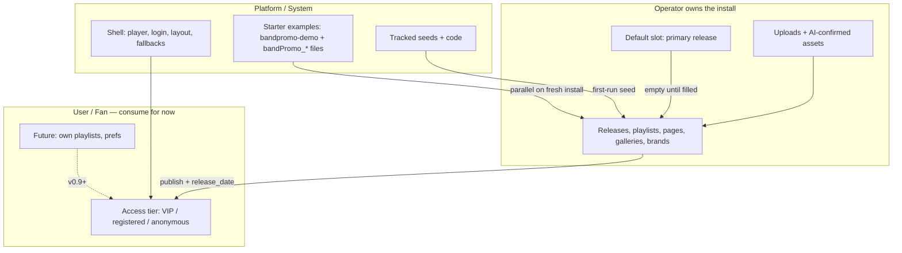

# bandPromo Platform Model (v0.8)

Source of truth for the v0.8 beta platform contract: releases, assets, containers, pages, brands, URLs, and legacy behaviour to remove.

Status: **policy updated** (2026-07-22 — operator mental model, closed-beta use cases, player nav target, Lyrics/Tracklist role). Implementation slices in [TODO.md](TODO.md).

Companion policy docs:

- [USE-CASES.md](USE-CASES.md) — closed-beta personas (Vanilla, Twisted Chronicles, HITZ)
- [ACCESS-MODEL.md](ACCESS-MODEL.md) — tiers, login, FAQ, shared links, VIP overrides
- [DELIVERY-ARCHITECTURE.md](DELIVERY-ARCHITECTURE.md) — protected delivery, PWA, cast scope
- [PORTABILITY.md](PORTABILITY.md) — full backup vs data export/import, moved-site repair

## Mental model (read this first)

**One sentence:** bandPromo is a platform shell that ships starter examples; operators own the install's creative truth; fans consume it with almost no ownership today.

Worked examples for closed-beta installs: [USE-CASES.md](USE-CASES.md).

The sections below are policy detail. This page is the compass — three actors, four layers, and the vocabulary traps that old names still cause.

### Three actors (who decides)

| Actor | Who | Owns today | Interface |
|-------|-----|------------|-----------|
| **Platform / system** | bandPromo product | Code, player shell, build pipeline, bundled demo package, fail-safe defaults | `biblioteca/`, `scripts/`, templates, CI |
| **Operator** | Band / site owner | Releases, playlists, pages, galleries, brands, uploads, publish | Admin panel |
| **User** | Fan / listener | Almost nothing (session; future prefs) | Player, login |

Operators are the content owners in v0.8. Fans have **access** to published material (tier rules in [ACCESS-MODEL.md](ACCESS-MODEL.md)), not containers or assets. Do not read "user content" as "fan-owned content" — registry `origin: user-upload` means **operator upload**.

### Four layers (what exists)

Think top-down:

1. **Shell** — layout, playback, access rules, mandatory fallbacks (player, login, dark atmosphere).
2. **Containers** — releases, playlists, pages, galleries, brands (`data/{type}/`).
3. **Assets** — registry entries with metadata and references (`data/assets/`).
4. **Files** — originals, masters, delivery on disk (`media/`).

Containers reference assets; assets point at files. Operators edit containers and upload assets. Publish produces delivery files. The player reads containers + registry, not raw filenames.

### Two platform-provided things (not operator creative work)

| Platform provides | Purpose | Examples |
|-------------------|---------|----------|
| **Shell** | Site must never break | Player layout, login, install fallbacks (`bandPromo_logo.png`, etc.) |
| **Starter examples** | First-run "it works" | `bandpromo-demo` release/playlist/gallery, `bandPromo_*` bundled audio |

Operators inherit starter examples, may hide them ("Hide demo catalog"), and replace them with their own containers. That is different from authoring them.

### Inside operator ownership: default slot vs real catalog

| Slot | Id today | What it is |
|------|----------|------------|
| **Default release slot** | `primary` | Empty catalog workspace — upload fallback, admin landing, delete safety net. Display title **Default release** on new seeds. **Not** demo; **not** "most important album." |
| **Operator catalog** | Any id they create | Real releases, playlists, galleries, pages, brands ("Summer EP", tour campaigns, etc.) |

### Asset provenance (orthogonal to actor)

Registry `origin` describes where a file came from, not who logged in:

| Origin | Meaning |
|--------|---------|
| `bundled-placeholder` | Shipped demo files (`bandPromo_*`) |
| `user-upload` | Operator uploaded |
| `ai-generated` | Wizard output (operator confirms) |
| `generated` | Build pipeline (optimized covers, share images, etc.) |

An operator-owned install can still contain platform-bundled assets. Separation is **provenance**, not a second content owner.

### Who owns what (cheat sheet)

| Thing | Owner | Lives in |
|-------|-------|----------|
| PHP/JS/Python code | Platform | repo |
| Templates / seeds | Platform | `biblioteca/templates/` |
| Install config + pointers | Operator (on host) | `web-config.json`, `data/install/` |
| Releases, playlists, pages, … | Operator | `data/{type}/` |
| Asset registry + metadata | Operator | `data/assets/` |
| Uploaded originals | Operator | `media/*/original/` |
| Bundled demo media | Platform (shipped into install) | `media/` (`bandPromo_*`) |
| Delivery files | Build output (derived) | `media/*/optimal/`, etc. |
| Fan session / future prefs | User | session; future user stores |

### Access vs ownership (users today)

- **Ownership** — who creates/edits containers and assets → operators (platform for shell + demo seeds).
- **Access** — who can play/read what → tier rules; operators always bypass.

v0.8 labels operator-made playlists `kind: "system"` until **user playlists** ship (v0.9+). In code, "system playlist" often means **site playlist**, not platform demo.

### Vocabulary traps

| Word in code/docs | Read it as |
|-------------------|------------|
| `primary` (release id) | **Default operator slot** — display title **Default release** on new seeds |
| `bandpromo-demo` | **Platform starter example** (hideable) |
| `system` (playlist `kind`) | **Site-level playlist** until user playlists exist |
| `system: true` (brand) | **Platform-shipped, locked** — duplicate to customize |
| `user-upload` (origin) | **Operator upload** (not fan upload) |
| `bundled-placeholder` | **Platform demo file** |
| Theme | Legacy name for **Brand** |

### How to read any path in five seconds

1. **Git or host?** — Git → platform. `data/` + `media/` on host → operator install (may include bundled demo).
2. **Edited or generated?** — `data/*.json` → edited. `media/*/optimal/` → generated delivery.
3. **Who is the audience?** — Admin → operator. Player/login → user. Templates/migrations → platform.

### Operator mental model (containers, brand, player)

Worked examples: [USE-CASES.md](USE-CASES.md).

**Containers:** Release (campaign umbrella), Playlist (ordered listening product), Gallery (visual set), Page (blocks). Brand is a fifth document under `data/brands/`, owned by a release via `brand_id` / `release_id` — not a peer campaign.

**Association exclusivity (shipped):** A playlist, gallery, or page with a non-empty `release_id` belongs to that release only. Release editor Available pools list **unowned** containers; saves refuse stealing from another release.

**Content pools (soft policy today):** Prefer that an owned playlist’s tracks and an owned gallery’s visuals come from that release’s catalog. **Not hard-enforced** in editors or save paths yet. Pages are not filtered to release assets/galleries yet. Tracks may still be orphans until associated.

**Active brand vs release brand:**

| Layer | Role |
|-------|------|
| Install **active** brand (`install.pointers.active_brand_id`) | Login chrome; shell media paths synced into `web-config.json`; fallback when a release has no valid `brand_id` |
| Release brand (`release.brand_id`) | Player **CSS tokens** while a track from that release plays (resolved from the track’s catalog `asset.release_id`, not from playlist ownership) |
| Demo `bandpromo-default` | Seed identity for the demo release; often the install active brand on fresh installs |

Opening a playlist does **not** rewrite active brand or shell config — only token overlay. Per-release shell media in the player is **planned** ([TODO.md](TODO.md) Brand shell override runtime).

**Player nav — current vs target:**

| | Current (shipped) | Target |
|--|-------------------|--------|
| Shell | Playlists + Lyrics always | Same (Lyrics label may follow per-track text role — see below) |
| Pages | Site-wide tabs from Content → Player (`show_in_player` / `tab_order`) | Optional **global** pages from Player editor + **contextual** pages associated to the **current track’s release** |
| Gallery | No dedicated Gallery module tab; use a page with gallery blocks | Same |
| FAQ | Login / global required surface | Same — not a campaign Bio |

Associating a page to a release does **not** yet add a player tab.

**Lyrics vs Tracklist (planned):** One shell panel and one master text field; per-master role `lyrics` \| `tracklist` renames the locked nav label while that track plays. Site-wide label alone is insufficient for label installs that need both (HITZ).

**Content admin strip:** Catalogue plus dedicated Playlist / Gallery / Pages / Branding / Player editors remain peers. Release editor handles base info, track membership, and associations — not full child editing.

### Map



### What to read next

| Question | Doc |
|----------|-----|
| What are releases, playlists, assets? | This file — **Terminology** and container sections below |
| Who can play what? | [ACCESS-MODEL.md](ACCESS-MODEL.md) |
| What does publish/build do? | [BUILD-PIPELINE-AUDIT.md](BUILD-PIPELINE-AUDIT.md) |
| What is legacy vs intentional shim? | [LEGACY-AUDIT.md](LEGACY-AUDIT.md) |
| What are we building next? | [TODO.md](TODO.md), [ROADMAP.md](ROADMAP.md) |

## Terminology

| Term | Meaning |
|------|---------|
| **Asset** | One stored media file or inline content fragment (audio, image, video, richtext HTML). Identified by `asset_id`. |
| **Release** | Campaign umbrella for a body of work (e.g. Violator): owns all related masters, identity (branding), EPK, galleries, and pages. Not a single streaming tracklist. |
| **Brand / identity** | Visual identity **of a release** (colors, typography, mood, logo, shell media, SFX). Stored as a brand document owned by that release — not a peer campaign object. |
| **Playlist** | Streaming listening product: album order, single package, tour set, radio campaign. Ordered refs into release-owned tracks; reusable across many playlists. |
| **Container** | Operator-managed document in `data/`: playlist, gallery, page, brand (identity), release. |
| **Block** | One composition unit inside a page container. |
| **Module** | Editor + renderer for a block or container type. |
| **Pool** | Available items when adding to a container (Content editor left column). |
| **Registry** | Index listing containers or assets of one type. |
| **Markdown (player text)** | Lightweight markup for player-shell operator copy (lyrics, descriptions). Stored as plain text; rendered to sanitized HTML at display — not used for page richtext blocks. |
| **Animated track cover** | Short silent loop video on the player flip-card cover; operator assigns in track editor; stored as `BANDPROMO_LIVING_COVER` in master tags. |

**Container-in-container** means **reference**, not folder nesting. Example: a page `gallery` block references a gallery container ID and a layout preset.

Admin UI uses friendly names (Release, Playlist, Gallery, Page, Branding). Docs and code use the terms above. **Theme** is a legacy name for brand identity during migration (`data/themes/` → `data/brands/`). **Era** is hindsight language — do not use it in operator UI.

## Asset identity and filenames

Operators must not depend on raw filenames. Disk names are stable IDs; human meaning lives in the asset registry.

### Three storage layers

| Layer | Purpose | On-disk name | Operator-visible |
|-------|---------|--------------|------------------|
| **Original** | Trust, recovery, audit | upload filename preserved; registry holds `original_filename` | Upload history only |
| **Master** | Canonical packaged file | `ast_{ULID}.{ext}` | No |
| **Delivery** | Playback/display derivatives | `ast_{ULID}` + variant (e.g. `/thumb.webp`, `/standard-stream.mp4`) | No |

Applies to **audio and visual** assets. Legacy visual files may still use human stems under `media/img/`, `media/photo/`, and `media/video/` until v0.8.4 migration completes.

### Asset ID format

- Prefix: `ast_`
- Body: **ULID** (Crockford base32, 26 characters)
- Example: `ast_01HY8K3M2P9XQ4R5S6T7V8W`

All containers, registries, playlists, releases, and deep links reference **`asset_id`**, never master filenames.

### Registry

`data/assets/registry.json` (or sharded `data/assets/{asset_id}.json`) maps each asset to:

- `display`: title, artist, version, alt text, etc.
- `slug`: unique **per release** for audio tracks (see URLs)
- `release_id` for an audio track's exclusive campaign/catalog home
- `original_filename`: exact upload name
- `storage`: paths to original, master, delivery tiers
- `tags`: explicit **role tags** and filter facets for unified media pools (see **Tags and roles**)
- `brand_id`: optional brand scope for visual assets (defaults to install active brand)
- `locked`: inherited from release lock (see below)

Human-readable export names (for future distributor handover ZIPs) are generated at **export time** from registry fields, not used as on-disk paths.

### Registry-first lookups (no JIT enrichment)

Admin UI, player, and notifications **read** the registry and published container documents only. They must not spawn Python, parse master tags, or walk `media/` “in case something changed.”

**Allowed write triggers** (anything else that updates registry metadata is a bug):

| Trigger | What updates |
|---------|----------------|
| Audio/image/video **upload** | Register asset; queue delivery job; **files index** entry (size/mtime/format/delivery flags) |
| **Tag / cover / living-cover save** | `assets[].display` (+ cover/living refs); clear player playlist payloads that include the track |
| **Delivery job success/fail** | `assets[].delivery.audio_optimal` + `data/delivery/inventory-snapshot.json`; **files index** pool_ready / video meta |
| **Catalog register / autofix** (explicit operator action) | Membership, masters |
| **Publish** | Player playlist payloads in `data/playlists/{id}.json`, validation report, inventory snapshot / delivery flags, **full files-index rebuild** |
| **Playlist reorder / release membership save** | Entry refs only (`master_file` / `asset_id` / `release_id`); clear player payload; mark build required — **no** tag parse |
| **Media delete** | Unregister asset; remove **files index** entry |

`assets[].delivery.audio_optimal` and `data/delivery/inventory-snapshot.json` are refreshed on delivery completion and Publish. Inbox / Deliverables inventory reads the snapshot, not live directory walks.

**Files listing** reads `data/media-library-state.json` → `files` only (size, mtime, audio_master, pool_ready, video_meta). Empty target triggers a one-time disk rebuild migration; after that, GET never walks `media/` or probes filesize/tags.

### Unified media pools

Three **operator pools** (Files). Two heavy pipelines (music audio vs visual); Sound effects is a lightweight third pool for brand UI clips.

| Pool | Contents | Operator surface |
|------|----------|------------------|
| **Audio** | Catalog / release music tracks | Files → Audio; release + playlist references |
| **Visual** | Still images **and** video | Files → Visual; gallery/page/brand/release visuals |
| **Sound effects** | Brand UI / navigation / interaction clips (welcome, login, future click/zoom, …) | Files → Sound effects; owned by **brands**; assigned from Content → Branding slots |

**Shipped (2026-07-21):** visual registry/delivery + Phase 3 operator wiring; **Sound effects** pool (`media/sfx/original/`, registry `kind=sfx`, single role `sfx`). **Still open:** Brand-assets disk fold (visuals still under `media/special/` until folded into Visual); living-cover `filename → ast_*`.

**Music audio stays separate from SFX** — FLAC masters, metadata repair, playlist coupling, and delivery MP3s must never mix with short brand UI clips.

### Asset identity applies to visual media too

Audio already uses `ast_{ULID}` on disk and in `data/assets/registry.json`. Visual assets should follow the same contract in v0.8.4:

- **Original** preserved under the upload name (audit/recovery) with `original_filename` in registry
- **Master** stored as `ast_{ULID}.{ext}` (canonical regeneration source)
- **Delivery** variants under `ast_{ULID}/` or `ast_{ULID}_{variant}.{ext}` — not human upload stems

Containers, galleries, pages, brands, and track covers reference **`asset_id`**, not `/media/img/original/my-logo.png`.

### Tags and roles (not folders)

Registry **`tags`**, **`brand_id`**, and derived facets replace folder location as the operator/filter model.

**Policy (2026-07-11):** **explicit role tags are primary.** Container references add usage context and validation; they do not replace the asset's tagged role.

| Facet | Purpose | Examples |
|-------|---------|----------|
| `role` | Intended use of the asset (visual pickers; default `unassigned` for bulk Visual uploads). Sound effects use a single role `sfx` — brand **slots** choose where a clip plays. | Visual: `brand-logo`, `track-cover`, … · SFX: `sfx` only |
| `brand_id` | Which brand identity package this asset belongs to (library filter) | `bandpromo-default`, `violator-era`, … |
| `media_type` | Intake/delivery pipeline branch | `image`, `video`, `audio` |
| `has_alpha` | Format/delivery policy | `true` for logos, overlays |
| `origin` | Provenance | `user-upload`, `bundled-placeholder`, `ai-generated`, `generated` |
| `delivery_ready` | Pool gating | computed from variant manifest |

**Upload defaults:**

- **Contextual upload** (picker in release editor, brand asset field, page picture): inherit `role` and `brand_id` from picker context.
- **Bulk upload** to Visual pool: `role: unassigned`, `brand_id` = install active brand until operator retags.
- Uploads never require role selection up front; Notifications may nudge when assets remain `unassigned`.

**Legacy intake:** on-disk folders `media/img/`, `media/photo/`, `media/video/`, and `media/special/` remain the storage buckets under Files → Visual and Files → Brand assets. They are **legacy intake paths**, not product categories. Migration registers existing files, assigns provisional roles, and retires folder-based mental models. **`special` is not a brand role** — Brand assets is only the operator label for that workaround path.

### Picker and admin filter contract

Media pickers declare a **context**; the backend returns assets from the Visual pool filtered for that context:

| Picker context | Typical filters |
|----------------|-----------------|
| Release cover | `media_type=image`, `brand_id` = release's linked brand (or install default), delivery-ready, square-friendly; role includes `release-cover` or `unassigned` |
| Track cover | `media_type=image`, delivery-ready, square-friendly |
| Gallery item | `media_type` image or video, delivery-ready |
| Page picture | `media_type=image`, delivery-ready |
| Brand logo | `media_type=image`, `brand_id` match, prefer `has_alpha`, roles `brand-logo` / `unassigned` |
| Brand portrait / style ref | `brand_id` match, roles `brand-portrait`, `style-ref`, `typography-sample` |
| Shell background video | `media_type=video`, `brand_id` match, role `shell-background-image` or `shell-background-video` |
| Share / poster source | `media_type=image`, large enough for share variant |

Admin **Files → Visual** exposes the image+video pool with type/usage/brand filters. **Files → Sound effects** holds brand UI audio (`role: sfx`); Branding slots pick any clip. **Files → Brand assets** remains a legacy tab for `media/special/` visuals until the Brand-assets fold (shell audio belongs in Sound effects).

`media/special/` and direct config paths migrate into the Visual pool as brand-scoped assets during v0.8; until then they remain a legacy workaround that bypasses the JPEG optimizer.

## Releases

A **release** is the campaign umbrella for a body of work — the thing industry meetings mean by “the Violator release”: every related master (album cuts, B-sides, live extras, remixes), identity/branding, EPK, press surfaces, and the listening products (playlists) that package those tracks for streaming.

It is **not** merely one CD tracklist. Album order vs Personal Jesus single package vs tour set are **playlists** under the same release.

### Rules

- Every audio track **should** belong to exactly one release (exclusive catalog home). Orphans (`release_id` empty) are allowed until associated. Playlists only reference tracks; they never own masters.
- Release track membership is an **unordered pool**. Listening order exists only in playlists.
- **Identity** (colors, typography, mood, logo, share/still/living shell, Welcome/Logged-in SFX) is **owned by the release** via its linked brand document (`brand_id`). Brand is not a competing peer campaign.
- Release owns campaign **galleries** and **pages** (e.g. Bio) via `release_id` on those containers (and optional reverse indexes on the release document).
- Release owns **listening products** as playlists with `release_id` set to this release; a track may appear in many of those playlists.
- **Normal operator flow:** playlist entries under a release come from that release’s track pool — prefer, not hard-enforced yet.
- `release_date` is the primary campaign/street date (often the album date). Individual playlist `publish_date` values carry single/tour package street dates.
- `poster_asset_id` is the release cover (album art), distinct from brand logo/share slots.
- **`catalog_id`**: optional operator catalog reference (for example `CD001`, `EP002`).
- Future **distribution handoff lock**: master immutable after external distributor handover.

### Operator hub

Content work starts in the **Catalogue** (list of releases). From one release operators manage:

- Tracks (catalog membership)
- Identity / Branding (tokens + shell media)
- Playlists (album / single / tour packages)
- Galleries and pages
- EPK / marketing fields

Playlist editors must not look like a second release catalog.

### Storage

```
data/releases/registry.json
data/releases/{release-id}.json
```

Release document (sketch):

```json
{
  "version": 1,
  "id": "violator",
  "slug": "violator",
  "title": "Violator",
  "release_date": "1990-03-19",
  "locked": false,
  "catalog_id": "CDSTUMM64",
  "brand_id": "violator-identity",
  "short_description": "One-line summary for cards and previews.",
  "description": "Press-ready blurb for this release.",
  "poster_asset_id": "ast_01HY8K3M2P9XQ4R5S6T7V8W",
  "epk": {
    "credits": "Produced by …",
    "press_contact": "press@example.com",
    "streaming_links": [
      { "label": "Spotify", "url": "https://open.spotify.com/album/…" }
    ],
    "press_photo_asset_ids": ["ast_01HY8K3M2P9XQ4R5S6T7V8X"]
  },
  "tracks": [
    {
      "asset_id": "ast_01HY8K3M2P9XQ4R5S6T7V8W",
      "slug": "personal-jesus"
    }
  ]
}
```

Legacy/deferred `catalog_id`, `epk.tagline`, `epk.genre`, `epk.credits`,
`epk.streaming_links`, and `epk.press_photo_asset_ids` values remain accepted
and preserved for package compatibility. Their operator schema is intentionally
deferred for a later EPK redesign.

Child containers (playlist / gallery / page / brand identity) carry `release_id` pointing here.

### Release locking

When `locked: true`:

- Member track metadata and tags are **not editable**.
- Release membership is **not editable**.
- Masters must not be deleted or re-encoded.
- Tracks remain playable and assignable to playlists under this release.
- Playlist reorder does **not** mutate files (see Legacy removal).

Future: `distribution_handoff_locked` for post-DistroKid/TuneCore-style handover.

## Playlists

Playlists are **streaming listening products** under a release: album sequence, single package (A-side + B-sides like *Dangerous*), tour set, radio campaign.

### Rules

- Entries reference `asset_id` (and carry `release_id` for analytics / ownership context).
- Prefer `release_id` on the playlist document = owning campaign release. Demo and normal operator flow: all entries come from that release.
- A track may appear in **multiple** playlists (reuse is the point).
- Playlist has its own `publish_date` (e.g. Personal Jesus 1989-08-29 vs album 1990-03-19).
- Playlist is shown **in full**; embargoed tracks appear but are **not playable** for the current user tier.
- Analytics bind plays to **track → release**, not to playlist.
- v0.8: operator site playlists use `kind: "system"` until **user/VIP playlists** ship (v0.9+). In code, "system playlist" often means **site playlist**, not platform demo.
- Player playlist selector appears when **two or more** catalog playlists are public (see Default playlist).
- **Player payloads** (`tracks`, `brand_styles`, `delivery_summary`) are written into `data/playlists/{id}.json` at Publish.

### Presentation metadata (v0.8.3+)

| Field | Playlists | Pages | Releases |
|-------|-----------|-------|----------|
| `catalog_id` | — | — | Operator catalog reference |
| `description` | Product blurb for share cards | Share/summary text | Press / EPK blurb |
| `poster_asset_id` | Product cover / share image | Share/OG image | Release cover (campaign art) |
| `release_id` | Owning campaign release | Owning campaign release | — |

**Release EPK** lives on the release. Playlists are listening products only — they must not duplicate catalog ownership or feel like a second release editor.
**Contact / email storage (v0.8.4+):** operator and release contacts use RFC 5322 strings (for example `7rym <7rym@7rym.net>`). Values are validated and canonicalized on save: control characters stripped, mailbox domains lowercased, display names trimmed. Empty contact is allowed when no valid mailbox can be derived (for example localhost dev installs). Outbound mail is not implemented in v0.8; this layer prepares consistent contact data for future press-reply and notification features and improves deliverability hygiene before any SMTP work lands.

### Default playlist

Among **registry** playlists that are demo-visible, non-empty, and public (`publish_date` empty or `<= today` UTC; operators may bypass future dates), select the one with the **latest** `publish_date`. Prefer an operator playlist over the demo playlist when demo would otherwise win. Player opens that playlist on first visit. There is no special `main` playlist id — clean installs seed `bandpromo-demo`; operator campaigns use their own ids.

### Storage

```
data/playlists/registry.json
data/playlists/{playlist-id}.json
```

Playlist position is **only** in the playlist container order. It must never write track numbers into audio masters.

## Galleries

Same container pattern as playlists, for image/video `asset_id` entries. Exposure is via page **gallery** blocks, not a permanent player tab.

```
data/galleries/registry.json
data/galleries/{gallery-id}.json
```

**Default system gallery:** clean installs seed the protected system gallery `bandpromo-demo` (`BANDPROMO_GALLERY_DEMO_ID`). Legacy id `main` is migrated into `bandpromo-demo` on seed (same pattern as playlist `main` removal).

## Pages and blocks

Canonical storage: `data/pages/*.json` + `data/pages/registry.json` (shipped).

### Block types

| Block | Content |
|-------|---------|
| `richtext` | Sanitized HTML body |
| `picture` | Image `asset_id` or `src`, layout, optional **plain-text** `caption` only |
| `picture_richtext` | Image + optional sanitized richtext `body` |
| `list` | Ordered/unordered items |
| `gallery` | `gallery_id` + `preset` (`grid`, `list`, `carousel`, `parallax`, …) |

All block types are implemented as **modules** (editor + renderer). Playlists and lyrics stay in the **player shell**; pages link in via deep links, not embedded players.

## Player text (Markdown)

**Status:** policy locked (2026-07-15 — closed-beta feedback). Implementation in [TODO.md](TODO.md).

Pages use **sanitized HTML richtext** (TinyMCE + HTMLPurifier). Player-facing operator text uses **Markdown source** rendered to safe HTML at display time. Two authoring models, one security bar: never inject raw operator strings into the DOM.

### Why Markdown here (not richtext)

- Lyrics, track descriptions, and release/playlist blurbs are edited in plain textareas today.
- Operators benefit from lightweight structure (`**emphasis**`, lists, links) without a page-style WYSIWYG.
- Plain text already stored in masters and containers remains valid Markdown (backward compatible).

### Storage contract (source stays Markdown/plain text)

| Field | Stored as | Persistence |
|-------|-----------|-------------|
| **Lyrics** | Markdown/plain text | Master FLAC/MP3 tags (`USLT` / `unsyncedlyrics`) |
| **Track description** | Markdown/plain text | Master tags (`COMM` / Vorbis `comment` / `description`) |
| **Release `description`** | Markdown/plain text | `data/releases/{id}.json` only — **not** audio tags |
| **Playlist `description`** | Markdown/plain text | `data/playlists/{id}.json` only |
| **Release EPK `credits`** | Markdown/plain text (when rendered in player/EPK surfaces) | `data/releases/{id}.json` → `epk.credits` |

**Do not** pre-render HTML into master tags or delivery MP3s. Exported files opened in other apps show raw Markdown syntax — expected and portable.

### Fields that stay plain text (no Markdown render)

| Field | Reason |
|-------|--------|
| `short_description` on releases, playlists, pages | Share cards, OG/meta previews need stripped one-line text |
| Titles, artist, and legacy tagline/genre/catalog ids | Identity labels, not body copy |
| Page `richtext` / `picture_richtext` blocks | Separate HTML authoring model (unchanged) |
| Page `picture` captions | Plain caption only (unchanged) |

### Rendering rules

1. **Render at output** — player (and any future EPK panel) converts Markdown → HTML through a **restricted allowlist** (headings, emphasis, lists, links, code, blockquote — same spirit as admin docs renderer).
2. **Sanitize** — strip scripts, event handlers, and arbitrary HTML from output; links get safe `rel` where external.
3. **Lyrics mode** — single line breaks in lyrics render as hard breaks (do not require Markdown's blank-line paragraph rule).
4. **Playlist track descriptions** — render through the same sanitizer; fix current unescaped `innerHTML` insertion.
5. **Share/OG** — when a Markdown field feeds meta tags, strip Markdown to plain text (no `**` in `og:description`).

### Master files and delivery (no tagging changes)

Markdown support is **display-only**. The audio pipeline is unchanged:

- Admin save → `audioMasterMetadata.py` writes UTF-8 text to master tags.
- Publish → `optimizeMedia.py` copies tags to delivery MP3.
- Build → `makePlaylists.py` reads tags into the player payload.

No new Vorbis/ID3 frame types, re-encode, or master migration required.

### Admin UX (v1)

- Keep textareas; add helper copy: **Markdown supported**.
- Live preview optional (later); not required for first ship.
- Character limits unchanged (e.g. track description 300 chars counts Markdown source).

### Module impact

| module_id | Change |
|-----------|--------|
| `player.lyrics` | Render Markdown in lyrics panel |
| `player.playlists` | Render Markdown in track description rows |
| `container.release` / `container.playlist` | No storage change; descriptions render when surfaced in player |

## Animated track covers (living cover)

**Status:** policy locked (2026-07-15 — closed-beta feedback). Implementation in [TODO.md](TODO.md).

Short, silent, looping video on the **main flip-card cover** when the operator assigns a **living cover** and video delivery is ready. Full music videos and gallery playback stay separate.

### Operator control

Assign in **Files → Audio → track editor → Living cover**. Pick any video from **Files → Visual** (video type filter / living-cover picker). The association is written into the **audio master tags** and travels with the file.

### Storage contract (master tags)

| Format | Tag | Value |
|--------|-----|-------|
| **MP3** | ID3v2 `TXXX` description `BANDPROMO_LIVING_COVER` | Video **original filename** (basename under `media/video/original/`) |
| **FLAC** | Vorbis comment `BANDPROMO_LIVING_COVER` | Same value |

Value is the stable on-disk video filename, not a human title. No sidecar files. No playlist JSON field.

**Do not** bake living-cover references into delivery MP3 tags in v1 unless the audio pipeline explicitly copies custom tags; player materialization reads the **master** tag via `playlistTrackEntries.py`, and fills an empty tag from the asset-registry display when the track editor has already assigned a living cover.

### Player resolution

1. Read `living_cover` from master tags when materializing playlist entries; if empty, use registry `display.living_cover`.
2. Resolve player URL only when `media/video/optimal/{stem}.mp4` delivery exists.
3. Static cover image remains the video poster, reflection source, and the fallback when living cover is unavailable (or reduced motion).

### Playback rules

1. **Explicit assignment only** — no filename stem guessing or silent sidecar pairing.
2. **Delivery only** — player uses optimal MP4 after Publish.
3. **Silent loop** — `muted`, `loop`, `playsinline`.
4. **Still while idle** — static cover when paused, stopped, or before first play.
5. **Living while playing** — loop video only while audio is actively playing. Independent of player shell Still/Living background.
6. **Reduced motion** — static cover when `prefers-reduced-motion: reduce`.
7. **Background tab** — still cover while hidden; living cover resumes when visible and playing.

### Deferred

- Visual-registry asset IDs instead of video filenames (when Visual pool ships).
- Per-track picker without opening full track editor (assignment already lives there).
- Animated lightbox / side-card previews.

## Brands (release identity)

**Brand** is the visual **identity package of a release** — colors, typography, mood narrative, and shell asset refs. It is not a separate campaign competing with Release.

**Release cover art stays on the release** (`poster_asset_id`). The brand document holds identity slots (logo, share/poster, still/living backgrounds, Welcome/Logged-in SFX) and presentation tokens for that release.

### System shell vs release identity overlay

**Product rule:** The platform always ships a complete, working shell. A release identity only overrides an **enumerated set of identity slots**; a broken identity degrades to ugly or default — never to a broken site.

| Layer | Owner | Always on | Examples |
|-------|-------|-----------|----------|
| **System shell** | bandPromo platform | Yes | Player/login/page layout, spacing, breakpoints, default dark atmosphere, mandatory install fallbacks, playback and access behavior |
| **Release identity overlay** | Operator (per release) | No — replaces slots only | Color tokens, typography, narrative brief, shell asset refs synced into config when that identity is active |

### Ownership rules (locked 2026-07-21)

- Each release has **one** identity brand document (`release.brand_id` ↔ `brand.release_id`).
- Do **not** model “many catalog SKUs → one shared brand era” as peer Releases. Album vs single packages are **playlists** under one Release.
- Install active identity (`install.pointers.active_brand_id`) selects which release’s identity drives login/player shell; preferably the active/demo release’s brand.
- Setup seeds locked **`bandpromo-default`** identity for the demo release; operators duplicate/customize as part of their own release, not as a free-floating Branding peer forever.

### Storage

```
data/brands/registry.json
data/brands/{brand-id}.json
```

Migration: `data/themes/` → `data/brands/`; brand documents gain `release_id`. Legacy many-to-one release→brand links dual-read until migrated.

- Content → **Branding** remains the identity editor (peer Content tab today; open from Catalogue associations when editing a release).
- **Set active** updates the install pointer and syncs that brand’s `assets` into config (login + shell media baseline).
- Duplicate still clones shell media so the copy has deletable files.
- Player token overlay uses the playing track’s release brand; see Operator mental model above.

### Semantic color and layout tokens

Brand containers expose tokens that map to CSS custom properties on `:root` (player, pages, login share one contract). Brand packs and GitHub ZIP distributions reuse this schema.

**Color tokens (required v0.8):**

| Token | CSS variable | Purpose |
|-------|--------------|---------|
| `color.primary` | `--primary-color` | Accent, active controls, progress |
| `color.secondary` | `--secondary-color` | Secondary accent, visited links |
| `color.background` | `--bg-color` | Page background |
| `color.text` | `--text-color` | Primary text |
| `color.text_muted` | `--color-text-muted` | Hints, secondary copy |
| `color.surface_mid` | `--color-surface-mid` | Gradient mid tone |
| `color.surface_deep` | `--color-surface-deep` | Gradient deep tone |
| `color.link` | `--color-link` | Default links |
| `color.link_hover` | `--color-link-hover` | Link hover |
| `color.link_visited` | `--color-link-visited` | Visited links on dark backgrounds |

**Layout:** Player cover art size (`--card-size`) is **not** a brand token. Responsive breakpoints and orientation rules live in `biblioteca/style.css`.

**Asset refs (Visual / Sound effects pools, scoped to this release identity):**

| Slot | Typical role / pool |
|------|---------------------|
| Logo / lockups | `brand-logo` |
| Default poster / share source | `brand-poster` |
| Member portraits | `brand-portrait` |
| Style / mood reference images | `style-ref` |
| Typography samples | `typography-sample` |
| Shell background image | `shell-background-image` |
| Shell background video | `shell-background-video` |
| Welcome / logged-in audio | Sound effects pool (`role: sfx`); usage via brand slots |
| Favicon package | optional; icons under `media/icons/` |

**Narrative:** `mood`, `keywords`, `tone_notes` — plain-language identity brief.

**Typography (v0.8 minimum):**

- `typography.font_family_base` — body/UI stack
- `typography.font_family_heading` — optional; falls back to base

Renderer injects tokens as `:root` overrides when a brand is active.

### Brand document sketch

```json
{
  "version": 1,
  "id": "bandpromo-default",
  "title": "bandPromo Default",
  "release_id": "bandpromo-demo",
  "system": true,
  "locked": true,
  "mood": "Clean demo identity for first-run installs",
  "keywords": ["demo", "electronic", "modern"],
  "tone_notes": "Neutral platform defaults; customize on your own release.",
  "tokens": {
    "color": { "primary": "#00d2ff", "secondary": "#3a7bd5", "background": "#121212" },
    "typography": { "font_family_base": "'Segoe UI', Tahoma, Geneva, Verdana, sans-serif" }
  },
  "assets": {
    "logo": "ast_…",
    "poster": "ast_…",
    "background_video": "ast_…",
    "welcome_audio": "/media/sfx/original/bandPromo_welcome.flac",
    "loggedin_audio": "/media/sfx/original/bandPromo_loggedin.flac"
  }
}
```

### Content AI wizards (v0.8)

Wizards use **release facts + that release’s identity narrative** + role-tagged asset refs as structured prompt context. Generated assets enter the Visual pool with `origin: ai-generated`; operator confirms before publish-relevant use.
## `data/` layout (source of truth)

All operator/user containers live under `data/`. Build output under `play/` is generated or deprecated — not the edit surface.

```
data/
  assets/registry.json
  releases/registry.json + {id}.json
  playlists/registry.json + {id}.json
  galleries/registry.json + {id}.json
  pages/registry.json + {id}.json      # shipped
  brands/registry.json + {id}.json     # replaces themes/
  player/layout.json                   # tab order (from web-config player branch)
```

Legacy paths (`data/playlist-order.json`, optional one-time `data/gallery.json` import) are **not runtime sources**. Admin save paths and readers use `data/playlists/`, `data/galleries/`, and the asset registry instead.

## URLs and deep links

Path-based URLs (no query strings for core navigation).

### Player

```
/play/{playlist-id}
/play/{playlist-id}/{release-slug}/{track-slug}
```

- `release-slug` and `track-slug` come from the release container and release membership.
- Track `slug` is unique **per release**, not globally.
- OG/share metadata for track links: track + release identity from containers/registry.

### Pages

```
/pages/{page-id}
```

Page share previews use page title plus first meaningful image block or release poster fallback.

## Track order

Release membership is unordered. Playlist position is stored only in
`data/playlists/{id}.json` `entries[]` order and must **never** sync into
ID3/FLAC `TRCK` tags. An embedded track-number tag is independent source
metadata; neither Release nor Playlist ordering owns it.

## Editor UX pattern

Content editors use one pattern (shipped for playlist/gallery/pages):

1. Left: pool of **containers** (playlists, galleries, pages, brands).
2. Right: preview of selected container.
3. **Add** or **edit** replaces the container list with a pool of **assets** (or block types) to insert.

## Module registry

Every block type and optional container feature is a **module** with a stable `module_id`, editor, and renderer.

### Core modules (always present)

Shipped in every install; may not be disabled in v0.8:

| module_id | Kind | Notes |
|-----------|------|-------|
| `block.richtext` | page block | Shipped |
| `block.picture` | page block | Plain caption variant |
| `block.picture_richtext` | page block | Image + richtext body |
| `block.list` | page block | Shipped |
| `container.playlist` | container editor | System playlists |
| `container.gallery` | container editor | System galleries |
| `container.page` | container editor | Shipped |
| `container.brand` | container editor | Brand pool editor (transitional id: `container.theme`) |
| `container.release` | container editor | Release catalog |
| `player.playlists` | player shell | Not a page block |
| `player.lyrics` | player shell | Not a page block |

### Optional modules (operator toggles)

Enabled per install via **Admin → Settings → Modules** (v0.8 policy: simple toggles UI).

| module_id | Default v0.8 | Notes |
|-----------|--------------|-------|
| `block.gallery` | on | Gallery block on pages |
| `player.tab.gallery` | **off** (forced) | Dedicated Gallery player tab removed; use page gallery blocks |
| `block.news` | off | v1+ |
| `block.fanboard` | off | v1+ |
| `quiz` | off | Non-core; modular assets |

### Registry storage

```
data/install/modules.json
```

```json
{
  "version": 1,
  "modules": {
    "block.gallery": { "enabled": true },
    "player.tab.gallery": { "enabled": false },
    "quiz": { "enabled": false }
  }
}
```

Disabled modules: hide editor entry points; renderer skips block type with admin-only placeholder in preview; player tabs omitted from layout.

## Access, delivery, portability (policy complete)

- **Access:** [ACCESS-MODEL.md](ACCESS-MODEL.md) — VIP per-release default + per-track override; anonymous sees embargoed tracks locked, not hidden.
- **Delivery / PWA / cast:** [DELIVERY-ARCHITECTURE.md](DELIVERY-ARCHITECTURE.md) — PHP authorizes, static delivery serves bytes; cast scope = full playable/viewable media (v0.9+).
- **Backup / export:** [PORTABILITY.md](PORTABILITY.md) — full backup (DR), data export (fresh install import), and **release package** export/import (planned v0.9).

## `web-config.json` target shape (install shell)

After migration, `web-config.json` holds **install shell + pointers only**:

```json
{
  "install": {
    "site": { "url": "", "language": "en", "author": "" },
    "social": { },
    "pointers": {
      "active_brand_id": "bandpromo-default",
      "active_release_id": null
    }
  },
  "support": { },
  "player": { }
}
```

Release identity and brand tokens move to `data/releases/` and `data/brands/`. Compatibility reads from legacy `site` / `media` / `release.*` / `data/themes/` branches continue until dual-write migration completes (see [MEDIA-HANDLING.md](MEDIA-HANDLING.md)).

## Legacy behaviour to remove

These behaviours come from the old single-playlist / filename-key model and must not survive the migration:

1. **`bandpromo_sync_playlist_order_to_audio_masters()`** in `biblioteca/save-playlist-order.php` — playlist save must not rewrite master tags.
2. **Playlist or release position as a metadata source** in audio master detail/save — embedded track number is independent source metadata.
3. **Filename-keyed** playlist order arrays — use `asset_id` in containers.
4. **Inferring release order from playlist position** in build/validation — release membership is unordered.

## Implementation order (v0.8)

1. Asset registry + ULID intake for new uploads; migrate existing masters to `asset_id`.
2. `data/releases` + required track membership; release locking.
3. `data/playlists` + remove playlist→master sync; migrate off legacy playlist artifacts.
4. Player: playlist selector, default-by-`publish_date`, path URLs with per-release slugs.
5. Embargoed tracks visible but non-playable in playlist UI.
6. `data/galleries` + page `gallery` block (grid preset minimum).
7. `data/brands/` + setup protected seed `bandpromo-default` + duplicate + active pointer (migrate from `data/themes/`).
8. Split `picture` / `picture_richtext` blocks.
9. Visual pool registry + role tags + brand-scoped pickers (see [TODO.md](TODO.md) v0.8 management slice).
10. Content AI wizards — operator-configured models; release + brand prompt context (v0.8).

## Related docs

- [USE-CASES.md](USE-CASES.md) — closed-beta personas (Vanilla, Twisted Chronicles, HITZ)
- [ROADMAP.md](ROADMAP.md) — milestone structure and beta expectations
- [TODO.md](TODO.md) — implementation checklist
- [ACCESS-MODEL.md](ACCESS-MODEL.md) — access tiers and login
- [DELIVERY-ARCHITECTURE.md](DELIVERY-ARCHITECTURE.md) — playback delivery and PWA
- [PORTABILITY.md](PORTABILITY.md) — backup and migration
- [MEDIA-HANDLING.md](MEDIA-HANDLING.md) — original/master/delivery tiers and validation
- [FEATURES.md](FEATURES.md) — operator-facing feature list
- [ADMIN-UI.md](ADMIN-UI.md) — admin chrome design system
