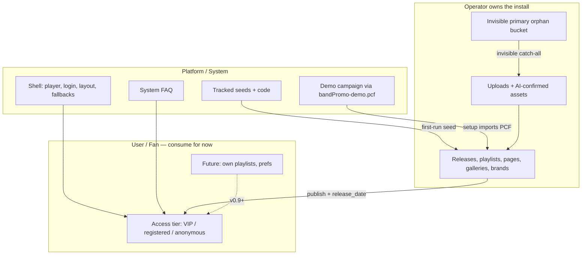

# bandPromo Platform Model (v0.8)

Source of truth for the v0.8 beta platform contract: releases, assets, containers, pages, brands, URLs, and legacy behaviour to remove.

Status: **policy updated** (2026-07-22 — operator mental model, closed-beta use cases, player nav target, Lyrics/Tracklist role). Implementation slices in [TODO.md](TODO.md).

Companion policy docs:

- [USE-CASES.md](USE-CASES.md) — closed-beta personas (Vanilla, Spandexual Tension, HITZ; Twisted Chronicles paused until v0.9)
- [ACCESS-MODEL.md](ACCESS-MODEL.md) — tiers, login, FAQ, shared links, VIP overrides
- [DELIVERY-ARCHITECTURE.md](DELIVERY-ARCHITECTURE.md) — protected delivery, PWA, cast scope
- [PORTABILITY.md](PORTABILITY.md) — full backup vs data export/import, moved-site repair

## Mental model (read this first)

**One sentence:** bandPromo is a platform shell that ships starter examples; operators own the install's creative truth; fans consume it with almost no ownership today.

Worked examples for closed-beta installs: [USE-CASES.md](USE-CASES.md).

The sections below are policy detail. This page is the compass — three actors, four layers, and the vocabulary traps that old names still cause.

### Three actors (who decides)

| Actor | Who | Owns today | Interface |
|-------|-----|------------|-----------|
| **Platform / system** | bandPromo product | Code, player shell, build pipeline, bundled demo package, fail-safe defaults | `biblioteca/`, `scripts/`, templates, CI |
| **Operator** | Band / site owner | Releases, playlists, pages, galleries, brands, uploads, publish | Admin panel |
| **User** | Fan / listener | Almost nothing (session; future prefs) | Player, login |

Operators are the content owners in v0.8. Fans have **access** to published material (tier rules in [ACCESS-MODEL.md](ACCESS-MODEL.md)), not containers or assets. Do not read "user content" as "fan-owned content" — registry `origin: user-upload` means **operator upload**.

### Four layers (what exists)

Think top-down:

1. **Shell** — layout, playback, access rules, mandatory fallbacks (player, login, dark atmosphere).
2. **Containers** — releases, playlists, pages, galleries, brands (`data/{type}/`).
3. **Assets** — registry entries with metadata and references (`data/assets/`).
4. **Files** — originals, masters, delivery on disk (`media/`).

Containers reference assets; assets point at files. Operators edit containers and upload assets. Publish produces delivery files. The player reads containers + registry, not raw filenames.

### Two platform-provided things (not operator creative work)

| Platform provides | Purpose | Examples |
|-------------------|---------|----------|
| **Shell** | Site must never break | Player chrome (Playlist + Lyrics + release page tabs), login, install fallbacks (`bandPromo_logo.png`, etc.) |
| **Starter campaign** | First-run "it works" | `bandPromo-demo.pcf` imported at setup → normal release + owned containers/assets |

Operators inherit the starter campaign, may **hide** it ("Hide bandPromo demo campaign") or **duplicate** it as a template, and replace it with their own containers. That is different from authoring the platform demo.

### Demo campaign policy (install preference)

The **first PCF imported at setup** becomes this install’s protected fallback campaign. Operators may still label it “bandPromo demo”; policy keys off the **internal campaign id** (PCF keeps `bandpromo-demo`; prefs also accept legacy `demo_release_id`).

| Preference | Storage | Meaning |
|------------|---------|---------|
| `demo_campaign_id` / `demo_release_id` | `data/install-preferences.json` | Protected demo campaign id (from first PCF import; derived from installed `platform_demo` / `bandpromo-demo` on upgrade if missing) |
| `demo_release_hidden` | same file | Operator hide toggle (`true` = hidden). Settings checkbox is **Hide bandPromo demo campaign**. Legacy `demo_catalog_visible` is the inverse, kept for API compat |

**Lock:** the demo campaign stays locked for operators. **Localhost only** may unlock, edit, and re-export the PCF. Remote HTTP may re-lock if somehow unlocked. No `system_managed` freeze beyond `locked`.

**Hide (catalogue home):** operators may hide that demo campaign’s containers (playlists / pages / galleries) and Files media whose **catalogue home** is the demo campaign (`assets[].release_id` == `demo_campaign_id`). Hide is offered only after the install has **operator catalogue**: an operator-created campaign that contains at least one track **and** a non-demo playlist that exposes that track. Hide is **always allowed** once that gate passes.

- Demo Audio/Visual with demo catalogue home leave Files → Audio / Visual and pickers when hidden.
- Demo Brand documents (including locked `bandpromo-default` when it is not Base) leave Branding and PBF export when hidden.
- **Base shell exception:** Demo Brand shell assets (Brand assets / Sound effects) stay listable while the **Base** brand (or another non-demo brand) still references them, so player chrome does not go blank. Operator-uploaded brand media is untouched.
- Demo pages (e.g. Band Bio / Gallery) leave Content → Pages; FAQ stays (install-owned).
- If the operator later deletes that catalogue so the gate no longer passes, **show the demo campaign again** (`demo_release_hidden=false`).

**Filename prefixes are not policy:** `bandPromo_*` and `bundled-placeholder` are display/provenance only. Hide/lock/delete enforcement uses campaign ownership + the prefs above.

**Upgrade safety:** if prefs are missing, derive `demo_campaign_id` from the installed platform demo campaign, default `demo_release_hidden=false`, and persist. Setup / ensure-demo and Admin bootstrap run that init after the Demo PCF is present. After **Site update**, when the published Demo PCF SHA differs from the install marker, the locked platform demo is refreshed (overwrite); hide preference is preserved; unlocked localhost authoring skips the refresh.

**Rule — no special demo content handling:** Once the campaign owns containers and assets, demo media/containers are not a second content system. Do not add heal/force/`bandPromo_*` → demo-campaign forks, parallel seed packs, or association exceptions “because demo.” Legitimate demo surfaces only: setup PCF import, lock (operators) / localhost unlock + export, hide, duplicate. `/media` is git-ignored; masters travel in PCF / campaign files.

### Inside operator ownership: default slot vs real catalogue

| Slot | Id today | What it is |
|------|----------|------------|
| **Orphan / upload bucket** | `primary` | **Invisible** catch-all for media not yet on a real campaign. Operators never manage or “see” this as a campaign — they only see audio/visual pools. **Not** demo; **not** “most important album.” |
| **Operator catalogue** | Any id they create (or import via PCF) | Real campaigns, playlists, galleries, pages, brands ("Winter Party", "the Retroscopy hour", etc.) |
| **Platform demo** | `bandpromo-demo` (persisted as `demo_campaign_id`) | Locked campaign from **`bandPromo-demo.pcf`** at setup (normal PCF import, then locked). Operators may hide / duplicate. Hide applies to demo containers + demo-homed Files media; Base-referenced shell stays visible. **Localhost** may unlock to edit and re-export the PCF. Remote HTTP may re-lock if somehow unlocked. No track sync, template seed, or `system_managed` freeze beyond `locked`. |

### Asset provenance (orthogonal to actor)

Registry `origin` describes where a file came from, not who logged in:

| Origin | Meaning |
|--------|---------|
| `bundled-placeholder` | Shipped demo files (`bandPromo_*`) |
| `user-upload` | Operator uploaded |
| `ai-generated` | Wizard output (operator confirms) |
| `generated` | Build pipeline (optimized covers, share images, etc.) |

An operator-owned install can still contain platform-bundled assets. Separation is **provenance**, not a second content owner.

### Who owns what (cheat sheet)

| Thing | Owner | Lives in |
|-------|-------|----------|
| PHP/JS/Python code | Platform | repo (`biblioteca/`, `scripts/`, root `vendor/` today; `lib/` after CODE-LAYOUT) |
| Templates / seeds | Platform | `biblioteca/templates/` |
| Install config + pointers | Operator (on host) | `web-config.json`, `data/install/` |
| Releases, playlists, pages, … | Operator | `data/{type}/` |
| Asset registry + metadata | Operator | `data/assets/` |
| Job / build state JSON | Platform writers on host | **`data/jobs/`** (target; today many still under `log/*.json` — Phase 0 hygiene) |
| Activity text logs + lock flags | Platform writers on host | `log/` (append-only `.log` + locks — not queues) |
| Scratch (demux, probes, ephemeral) | Platform | `temp/` only |
| Uploaded originals | Operator | `media/*/original/` |
| Bundled demo media | Platform (shipped into install) | `media/` (`bandPromo_*`) |
| Delivery files | Build output (derived) | `media/*/optimal/`, etc. |
| Fan session / future prefs | User | session; future user stores |

### Access vs ownership (users today)

- **Ownership** — who creates/edits containers and assets → operators (platform for shell + demo seeds).
- **Access** — who can play/read what → tier rules; operators always bypass.

v0.8 labels operator-made playlists `kind: "system"` until **user playlists** ship (v0.9+). In code, "system playlist" often means **site playlist**, not platform demo.

### Vocabulary traps

| Word in code/docs | Read it as |
|-------------------|------------|
| `primary` (release id) | **Invisible orphan/upload bucket** — not an operator-facing campaign |
| `bandpromo-demo` | **Platform demo campaign** from `bandPromo-demo.pcf` (hideable, read-only) |
| `.pcf` / PCF | **Portable Campaign File** — one campaign ([PORTABILITY.md](PORTABILITY.md)). Never call it a ZIP in operator copy. Legacy `.prp` import still works. |
| `.pbf` / PBF | **Portable Brand File** — one brand + curated library ([PORTABILITY.md](PORTABILITY.md)). Never call it a ZIP in operator copy. |
| `system` (playlist `kind`) | **Site-level playlist** until user playlists exist |
| `system: true` (brand) | **Platform-shipped** — locked on hosted installs; localhost may edit for PCF source; operators duplicate to customize |
| `user-upload` (origin) | **Operator upload** (not fan upload) |
| `bundled-placeholder` | **Platform demo file** (legacy wording; demo media travels in the Demo PCF) |
| Theme | Legacy name for **Brand** |

### How to read any path in five seconds

1. **Git or host?** — Git → platform. `data/` + `media/` on host → operator install (may include bundled demo).
2. **Edited or generated?** — `data/*.json` (catalogue / jobs) → durable data. `log/*.log` → Activity. `temp/` → scratch. `media/*/optimal/` → generated delivery.
3. **Who is the audience?** — Admin → operator. Player/login → user. Templates/migrations → platform.

### Operator mental model (containers, brand, player)

Worked examples: [USE-CASES.md](USE-CASES.md).

**Containers:** Campaign (umbrella; storage still uses some `release_*` API/path names), Playlist (ordered listening product), Gallery (visual set), Page (blocks). Brand is a fifth document under `data/brands/`, owned by a campaign via `brand_id` / `campaign_id` — not a peer campaign.

**Association exclusivity (shipped):** A playlist, gallery, or page with a non-empty `campaign_id` belongs to that campaign only. Campaign editor Available pools list **unowned** containers; saves refuse stealing from another campaign.

**Catalogue home (source of truth):** Every audio and visual master has an exclusive catalogue home on `assets[].release_id` (operator copy: Campaign; empty/`primary` = Orphan). Usage refs (playlist entry, gallery entry, poster, cover, page block) are **consumers only** — they do not invent a second membership. Files → Audio / Visual **Catalogue** and campaign filters follow **home**. **Brand library membership** is brand-scoped (`library_asset_ids` / shell slots), not a campaign; Files → Sound effects **Brand** column and brand filters follow **library membership**, not the registry `brand_id` upload stamp. Catalogue must not infer campaign from Brand ownership on the asset.

**Content pools (enforced on save):** An owned playlist’s tracks and an owned gallery’s / page’s visuals must come from that campaign’s catalogue (same home), or be orphans that Site health can stamp. Editors refuse new foreign-home picks. Legacy foreign refs still pack on PCF export of the referencer (dependency copy); catalogue home stays on the owning campaign until the operator rehomes. **In use / Unused** matches the Visual `ast_*` id after resolving stored refs (titles and stems never match). Stored cover refs that still hold a **former** visual id resolve when the live row’s original/master filename is `{old_id}.ext`. Delivery URLs `/media/visual/delivery/{id}/…` resolve by the path id, not the variant filename (`card.jpg`).

**Orphan in a container:** Site health finding `orphan_assets_in_containers` (Review → Apply) stamps home to the single campaign that owns the referencing playlist/gallery/page. Multi-campaign orphans (`orphan_assets_multi_campaign`) are reported with clash detail in Proposed treatment — the operator picks which campaign should own the catalogue home and stamps it there; Site health never auto-guesses. Never overwrite a non-empty home. PCF export does not mutate homes.

**Data janitor (v0.8):** Site health also probes `data/` (separate from the media janitor). Ephemeral leftovers (`data_janitor_ephemeral` → Treat `data_janitor_prune`) clear OS junk, stale `upload_tmp` files older than 24h, and empty scratch folders — never `terces`, setup markers, install prefs, analytics, assets, campaigns, brands, or site-health plan files. Invisible playlist/gallery/page docs that already stamp a valid campaign home (`data_container_unlinked` → `data_container_relink`) are registered into their type registry (and registry stubs with no document are dropped). Orphan/unowned containers (`data_container_orphans`) stay Manual in Proposed treatment: **Adopt** into a chosen campaign or **Delete** with a named confirm — Site health never auto-guesses. System shell pages (`faq`, `bio`, `gallery`) and locked demo containers are skipped.

**PCF membership:** Pack all audio/visual rows whose home is the campaign, plus owned brand library/slots and container-referenced masters (foreign homes travel as dependencies). Site health heals empty homes before relying on home-only collect.

**Base brand vs release brand:**

| Layer | Role |
|-------|------|
| Install **base** brand (`install.pointers.active_brand_id` / legacy `active_theme_id`) | Login chrome; shell media paths synced into `web-config.json`; fallback when a playlist’s owning release has no valid `brand_id`. Operator UI label: **Base** (storage key unchanged). |
| Release brand (`release.brand_id`) | Player **CSS tokens** for playlists owned by that release (`playlist.campaign_id` → release brand). Tracks do not carry player brand. |
| Demo `bandpromo-default` / demo brand | Seeded from **`bandPromo-demo.pcf`** as install **base shell**; locked after import (localhost may edit for PCF authoring). Fresh installs keep this as Base until the operator **duplicates** it in Branding — setup does not auto-create “Your own brand”. Demo Brand shell media under Files → Visual / Sound effects stays listable while Base (or another non-demo brand) references it; otherwise hides with **Hide bandPromo demo campaign**. |

Selecting a **campaign** (and its playlist) applies that campaign’s **CSS tokens and visual shell** (logo, still/living backgrounds). It does **not** rewrite the base brand or `web-config.json` unless the operator changes Base. Welcome/Logged-in SFX stay on the base brand (login).

**Publish must not steal Base:** Demo PCF ensure/import may refresh demo documents, but it must **not** reset `active_brand_id` after an operator has chosen a brand (first-run empty pointer only).

**Player chrome (brand-owned):** Cover size (`player.cover_size`: `full` | `medium` | `half` → 100%|75%|50% of platform `--card-size`), cover reflection (`player.cover_reflection`, default `true`) and **side covers** (`player.side_covers`, default `true`, with fill / spread / colour / navigate) live under Branding → Player → **Cover**. Beggars banquet (`player.beggars_banquet`, default `true`) and **Login / status** (`player.login_status`, default `false`) live under Branding → Player → **User area**. Transport glass fill/blur live under Player → **Controls**. **Playlist selector** style (`player.playlist_selector`: `dropdown` | `buttons` | `coverflow`, default `coverflow`) lives under Branding → Content. All travel on the **Base brand** document with brands/PCFs. Cover size scales the platform cover clamps via `--cover-size-scale` (scene, transport width, split rail, side-cover offsets). Cover reflection is the mirrored still under the main flip-card on large split layouts. Side covers are the faint prev/next track covers flanking the main cover (optional; Navigate Off keeps them decorative). Login / status shows a signed-in strip with Log out under the transport (compact login form when anonymous player entry ships). Beggars banquet is the in-flow support CTA under the player transport; Settings → Support still owns destination, label, and colours. Shell backdrop has **no Still|Living toggle** — if the brand assigns living video, `/play` prefers it (still paints first; reduced-motion / slow-connection stay on still). Track living covers follow the same assignment-is-intent rule.

**Player Campaign navigator (locked — v0.8 exit gate; chrome re-locked 2026-09-09):**

Campaign-first listening scope (HITZ multi-campaign). Header logo is **identity only**. Campaign switching lives **inside the Playlists panel** (fans switch campaigns to reach other playlists — not as always-on tab chrome).

| Rule | Behaviour |
|------|-----------|
| Polarity | Select **campaign** first; playlist selector lists **only that campaign’s public playlists** |
| Chrome | Current campaign **logo** in the header is static (`.content-logo-img`) — not a button. When **≥2** public campaigns, a **campaign logo strip** sits at the top of the Playlists panel (wide ~2:1 chips; logos + `aria-label` / `title` only — no visible “Campaigns” label). Playlist selector stays brand-owned (`coverflow` / `buttons` / `dropdown`); covers stay ~1:1 |
| Layout | Wide: campaign strip and playlist selector share one toolbar row when both visible. Narrow: stack (campaigns first, then playlists). Neither control appears in `.content-toggle` |
| Single campaign | Hide campaign strip; header logo only (identity) |
| Single playlist | If the selected campaign has **≤1** public playlist, **hide** the playlist selector (per campaign, not install-wide count) |
| Defaults | Browser **`localStorage`**: last campaign + last playlist per campaign + last track and playback position per playlist (until a future user-state registry). Else campaign that owns the ★ default playlist; within campaign open last playlist else ★ default; within playlist open last track else first playable; resume mid-track when a position is stored (deep links start at 0) |
| Idle chrome | Selected campaign drives **brand shell + page tabs** even before play |
| Playback | **Campaign change stops playback**. Playlist change within campaign may keep playing until a new track starts |
| After campaign switch | Land on that campaign’s last-played playlist **and track**, scrubbed to the saved position (else defaults), **paused** |
| Deep links | Override memory **on that load only**. Paths are campaign-first only (see URLs) — **hard cut**, no legacy playlist-first URLs |
| Scale | Playlists-panel strip is for **a few** campaigns; large-catalogue campaign UI is later debt |
| Logo presentation | Player campaign chips use a **wide (~2:1)** frame with `object-fit: contain`. Prefer 2:1 brand logos in Branding (guidance); do not hard-block non-2:1 uploads in this slice |

**Player nav (shipped + navigator):**

| | Rule |
|--|------|
| Shell | Playlists + Lyrics/Notes always |
| Campaign pages | Tabs for pages associated to the **selected / playing campaign** (Campaign editor → Pages; association order = tab order). That editor lists the same page name as Content → Pages (registry title). Player tab text is the page `label`. Legacy site-wide `player.tab_order` / `show_in_player` is fallback only when that campaign has no owned pages |
| Gallery | Demo (and operator) **Gallery page** with a gallery block; not a separate mandatory module tab |
| FAQ | **System-owned** install page — login/platform help; **not** in any PCF; survives hide-demo |

Content → **Player layout** is retired (URLs redirect to Catalogue). Brand chrome lives under Branding.

**Duplicate campaign (same install):** New container/brand/release ids; **shared** media `ast_*`; cannot delete an asset while multiple containers reference it. **Import** between installs **keeps** ids. See [PORTABILITY.md](PORTABILITY.md).

**Delete campaign:** operators choose **Entire campaign** (default) or **Campaign only**. Entire campaign removes owned brand, playlists, galleries, pages, and media that nothing else still references; shared media from a prior duplicate is retained. Campaign only removes the catalogue container and clears asset `release_id` pointers — Files media stays. Platform demo / protected ids cannot be deleted.

**Lyrics vs Notes (shipped):** One shell panel and one master Lyrics field (tag + `display.lyrics`). Per-track `display.text_role` is `lyrics` (default) or `notes`; when Notes, optional `notes_label` (default player nav **Tracklist**, e.g. Show notes / Transcript). Site-wide `player.modules.lyrics.label` remains the Lyrics-mode fallback. Dual fields remain deferred.

**Timed cues (locked policy — implement later):** Tester-requested timed lyrics / tracklist cues. **Interchange:** SubRip **`.srt`**. **Canonical store:** registry cue list on the audio asset (e.g. `display.lyrics_cues[]` with `start_ms`, `end_ms`, Markdown `text`). **Still | living:** one copy only — still ignores times and renders cue Markdown in order; living highlights / auto-scrolls by playback time (same polarity as living cover → still fallback). **Export:** derive **USLT** on the master from the still projection (Markdown as text, today’s write path); optional PCF `.srt` sidecar later — no parallel operator-edited body, no SYLT unless revisited. **Import/export `.srt`:** maps to/from the cue list; SRT has no Markdown dialect — keep Markdown literals in cue text or offer a plain-text flatten on export; import treats cue bodies as Markdown. Untimed tracks keep today’s single `display.lyrics` string until cues exist; when cues exist, any `display.lyrics` / USLT string is **derived**, not a second source of truth.

**Explicitly out of scope for this lock:** dual Lyrics+Notes fields; auto karaoke from audio; SYLT as primary export; WebVTT/LRC as interchange (rejected for now — revisit only if `.srt` fails operators).

HITZ care-about is timed **Tracklist** (Notes) as much as karaoke Lyrics.

**Content admin strip:** Catalogue plus dedicated Playlist / Gallery / Pages / Branding editors remain peers. Campaign editor handles base info, track membership, and associations — not full child editing.

### Map



### What to read next

| Question | Doc |
|----------|-----|
| What are releases, playlists, assets? | This file — **Terminology** and container sections below |
| Who can play what? | [ACCESS-MODEL.md](ACCESS-MODEL.md) |
| What does publish/build do? | [BUILD-PIPELINE-AUDIT.md](BUILD-PIPELINE-AUDIT.md) |
| What is legacy vs intentional shim? | [LEGACY-AUDIT.md](LEGACY-AUDIT.md) |
| What are we building next? | [TODO.md](TODO.md), [ROADMAP.md](ROADMAP.md) |

## Terminology

| Term | Meaning |
|------|---------|
| **Asset** | One stored media file or inline content fragment (audio, image, video, richtext HTML). Identified by `asset_id`. |
| **Release** | Storage name for the campaign umbrella (`release_id`, `data/releases/`). **Operator UI: Campaign.** Owns related masters, identity (branding), EPK, galleries, pages, and playlists. Not a single streaming tracklist. |
| **Brand / identity** | Visual identity **of a release** (colours, typography, mood, logo, shell media, SFX). Stored as a brand document owned by that release — not a peer campaign object. |
| **Playlist** | Streaming listening product: album order, single package, tour set, radio campaign. Ordered refs into release-owned tracks; reusable across many playlists. |
| **Container** | Operator-managed document in `data/`: playlist, gallery, page, brand (identity), release. |
| **Block** | One composition unit inside a page container. |
| **Module** | Editor + renderer for a block or container type. |
| **Pool** | Available items when adding to a container (Content editor left column). |
| **Registry** | Index listing containers or assets of one type. |
| **Markdown (player text)** | Lightweight markup for player-shell operator copy (lyrics, descriptions). Stored as plain text; rendered to sanitized HTML at display — not used for page richtext blocks. |
| **Animated track cover** | Short silent loop video on the player flip-card cover; operator assigns in track editor; stored as `BANDPROMO_LIVING_COVER` in master tags. |

**Container-in-container** means **reference**, not folder nesting. Example: a page `gallery` block references a gallery container ID and a layout preset.

Admin UI uses friendly names (Campaign, Playlist, Gallery, Page, Branding). Ownership key is **`campaign_id`**. Load/save **migrate-and-delete** leftover container `release_id` via `bandpromo_document_with_campaign_id`. A single central reader (`bandpromo_document_campaign_id`) still accepts legacy `release_id` until the **v0.9 fleet cut** (all test installs upgraded) — then delete that fallback and require `campaign_id` only. Do **not** scatter dual-read/write shims. On-disk campaign documents live under **`data/campaigns/`** (legacy `data/releases/` renamed on ensure). **Theme** is a legacy name for brand identity during migration (`data/themes/` → `data/brands/`). **Era** is hindsight language — do not use it in operator UI.

## Asset identity and filenames

Operators must not depend on raw filenames. Disk names are stable IDs; human meaning lives in the asset registry.

### Three storage layers

| Layer | Purpose | On-disk name | Operator-visible |
|-------|---------|--------------|------------------|
| **Original** | Trust, recovery, audit | upload filename preserved; registry holds `original_filename` | Upload history only |
| **Master** | Canonical packaged file | `ast_{ULID}.{ext}` | No |
| **Delivery** | Playback/display derivatives | `ast_{ULID}` + variant (e.g. `/thumb.webp`, `/standard-stream.mp4`) | No |

Applies to **audio and visual** assets. Legacy visual files may still use human stems under `media/img/`, `media/photo/`, and `media/video/` until v0.8.4 migration completes.

### Asset ID format

- Prefix: `ast_`
- Body: **ULID** (Crockford base32, 26 characters)
- Example: `ast_01HY8K3M2P9XQ4R5S6T7V8W`

All containers, registries, playlists, releases, and deep links reference **`asset_id`**, never master filenames.

### Registry

`data/assets/registry.json` (or sharded `data/assets/{asset_id}.json`) maps each asset to:

- `display`: title, artist, version, alt text, etc.
- `slug`: unique **per release** for audio tracks (see URLs)
- `release_id` for an audio track's exclusive campaign/catalogue home
- `original_filename`: exact upload name
- `storage`: paths to original, master, delivery tiers
- `tags`: explicit **role tags** and filter facets for unified media pools (see **Tags and roles**)
- `brand_id`: optional brand scope for visual assets (defaults to install base brand)
- `locked`: inherited from release lock (see below)

Human-readable export names (for future distributor handover ZIPs) are generated at **export time** from registry fields, not used as on-disk paths.

### Registry-first lookups (no JIT enrichment)

Admin UI, player, and notifications **read** the registry and published container documents only. They must not spawn Python, parse master tags, or walk `media/` “in case something changed.”

**Allowed write triggers** (anything else that updates registry metadata is a bug):

| Trigger | What updates |
|---------|----------------|
| Audio/image/video **upload** | Register asset; queue delivery job; **files index** entry (size/mtime/format/delivery flags) |
| **Tag / cover / living-cover save** | `assets[].display` (+ cover/living refs); **keep last-good** player payloads; ensure delivery MP3 stays **tagless** when present; quiet republish playlists that include the track (never leave `/play` on empty `tracks`) |
| **Delivery job success/fail** | `assets[].delivery.audio_optimal` + `data/delivery/inventory-snapshot.json`; **files index** pool_ready / video meta |
| **Catalogue register / autofix** (explicit operator action) | Membership, masters |
| **Publish** | Player playlist payloads in `data/playlists/{id}.json`, validation report, inventory snapshot / delivery flags, **full files-index rebuild** |
| **Playlist reorder / release membership save** | Entry refs only (`master_file` / `asset_id` / `release_id`); clear player payload; mark build required — **no** tag parse |
| **Media delete** | Unregister asset; remove **files index** entry |

`assets[].delivery.audio_optimal` and `data/delivery/inventory-snapshot.json` are refreshed on delivery completion and Publish. Inbox / Deliverables inventory reads the snapshot, not live directory walks.

**Files listing** reads `data/media-library-state.json` → `files` only (size, mtime, audio_master, pool_ready, video_meta). Empty target triggers a one-time disk rebuild migration; after that, GET never walks `media/` or probes filesize/tags.

### Unified media pools

Three **operator pools** (Files). Two heavy pipelines (music audio vs visual); Sound effects is a lightweight third pool for brand UI clips.

| Pool | Contents | Operator surface |
|------|----------|------------------|
| **Audio** | Catalogue / release music tracks | Files → Audio; release + playlist references |
| **Visual** | Still images **and** video | Files → Visual; gallery/page/brand/release visuals |
| **Sound effects** | Brand UI / navigation / interaction clips (welcome, login, future click/zoom, …) | Files → Sound effects; owned by **brands**; assigned from Content → Branding slots; three-tier `media/sfx/{original,master,optimal}` |

**Shipped (2026-07-21):** visual registry/delivery + Phase 3 operator wiring; **Sound effects** pool (`media/sfx/original/`, registry `kind=sfx`, single role `sfx`).

**Completion track (policy locked 2026-08-04):** finish three-tier visuals like audio — `asset_id` refs everywhere → on-disk `media/visual/master/ast_*` → XXH3 skip-if-current (**built / kept / failed**) → kill dual-write/`special` → operator titles → release-package export. See [TODO.md](TODO.md) → Visual identity completion (M1–M6) and [MEDIA-HANDLING.md](MEDIA-HANDLING.md).

**Music audio stays separate from SFX** — FLAC masters, metadata repair, playlist coupling, and delivery MP3s must never mix with short brand UI clips.

### Asset identity applies to visual media too

Audio already uses `ast_{ULID}` on disk and in `data/assets/registry.json`. Visual assets follow the **same three-tier contract**:

- **Original** preserved under the upload name with `original_filename` in registry — copied to `media/visual/original/` (legacy intake buckets remain dual-read until M4)
- **Master** stored as `media/visual/master/ast_{ULID}.{ext}` (canonical regeneration source)
- **Delivery** variants under `media/visual/delivery/{ast_{ULID}}/{variant}` — not human upload stems

Containers, galleries, pages, brands, track covers, living covers, and social/share slots reference **`asset_id`**, not path strings. Paths exist only as **resolved URLs** from the delivery helper.

**Replace upload:** same `original_filename` reuses one `ast_*` and overwrites master bytes (no clone storm).

**Operator identity (visual `display`):** registry `assets[].display` for `kind=visual` holds human fields — **`title`**, **`description`**, optional **`captured_at`**, optional **`keywords`**. These are the primary names operators search and edit. When `display.title` is empty, Files / pickers fall back to the **original filename stem** (underscores and hyphens become spaces). ULID originals (`ast_*`) are skipped so re-registered files do not list as ids. Track covers still synthesize **`Track cover: {linked track title}`** when a track is linked. Role labels (`Unassigned`, `Gallery`, …) via `operator_title` are the last resort, not the default name — not brand or release suffixes. When build **extracts** embedded art from a master into a new Visual original, it one-time seeds empty fields only: `display.title` as **`Track cover: {track title}`**, `keywords` as **`[role, artist]`** (e.g. `Track cover`, artist name), and `captured_at` from the audio catalogue/tag date when available. Later builds, hash-match reuse, and assigned covers never overwrite those fields. Listing still synthesizes `Track cover: {linked track title}` when `display.title` is empty.

**Operator address (Files / pickers):** **title first** when set; else role + linked context; `ast_*` secondary; original upload name tertiary. Shared assets show “used by N”; delete warns when multiple live refs.

**Still masters — EXIF read, IPTC write:** Camera **EXIF** stays camera-origin (read `DateTimeOriginal` / GPS for `captured_at`; do not overwrite editorial fields into EXIF). Operator title / description / keywords are written as **IPTC Core** serialized in an **XMP** packet on the **master** image only. Autofix heals *empty* registry `display` from embedded IPTC/XMP (and EXIF dates).

**Video masters — MKV; delivery — MP4:** On register/materialize, remux intake to `media/visual/master/ast_*.mkv` with stream copy (no re-encode). Matroska tags carry title / description / keywords / date. Original intake bytes stay under `media/visual/original/` (or legacy intake). Delivery stays `standard-stream.mp4` (silent for brand `role=shell-background-video` and living covers). Browsers never load MKV.

**Shared track covers:** identical intake/embedded image bytes map to one Visual asset. Content identity uses **XXH3** (`content_xxh3`; dual-read legacy `content_sha256` during migration). Multiple audio tracks link to that `asset_id`; build must not mint per-stem clones when a match exists.

**Content hashing:** XXH3 is the product standard for freshness and dedupe. SHA-256 remains only for cryptographic integrity of published release ZIP manifests.

### Tags and roles (not folders)

Registry **`tags`**, **`brand_id`**, and derived facets replace folder location as the operator/filter model.

**Policy (2026-07-11):** **explicit role tags are primary.** Container references add usage context and validation; they do not replace the asset's tagged role.

| Facet | Purpose | Examples |
|-------|---------|----------|
| `role` | Intended use of the asset (visual pickers; default `unassigned` for bulk Visual uploads). Sound effects use a single role `sfx` — brand **slots** choose where a clip plays. | Visual: `brand-logo`, `track-cover`, … · SFX: `sfx` only |
| `brand_id` | Optional registry stamp / provenance (may lag). **Membership SoT for shell media is brand `library_asset_ids` (+ slots).** Files Brand column follows libraries. | `bandpromo-default`, `brd_01hy8k3m2p9xq4r5s6t7`, … |
| `media_type` | Intake/delivery pipeline branch | `image`, `video`, `audio` |
| `has_alpha` | Format/delivery policy | `true` for logos, overlays |
| `origin` | Provenance | `user-upload`, `bundled-placeholder`, `ai-generated`, `generated` |
| `delivery_ready` | Pool gating | computed from variant manifest |

**Upload defaults:**

- **Contextual upload** (picker in release editor, brand asset field, page picture): inherit `role` and `brand_id` from picker context.
- **Bulk upload** to Visual pool: `role: unassigned`, `brand_id` = install base brand until operator retags.
- Uploads never require role selection up front; Notifications may nudge when assets remain `unassigned`.

**Legacy intake:** on-disk folders `media/img/`, `media/photo/`, `media/video/`, and `media/special/` remain the storage buckets under Files → Visual and Files → Brand assets. They are **legacy intake paths**, not product categories. Migration registers existing files, assigns provisional roles, and retires folder-based mental models. **`special` is not a brand role** — Brand assets is only the operator label for that workaround path.

### Picker and admin filter contract

Media pickers declare a **context**; the backend returns assets from the Visual pool filtered for that context:

| Picker context | Typical filters |
|----------------|-----------------|
| Release cover | `media_type=image`, `brand_id` = release's linked brand (or install default), delivery-ready, square-friendly; role includes `release-cover` or `unassigned` |
| Track cover | `media_type=image`, delivery-ready, square-friendly |
| Gallery item | `media_type` image or video, delivery-ready |
| Page picture | `media_type=image`, delivery-ready |
| Brand logo | `media_type=image`, `brand_id` match, prefer `has_alpha`, roles `brand-logo` / `unassigned` |
| Brand portrait / style ref | `brand_id` match, roles `brand-portrait`, `style-ref`, `typography-sample` |
| Shell background video | `media_type=video`, `brand_id` match, role `shell-background-image` or `shell-background-video` |
| Share / poster source | `media_type=image`, large enough for share variant |

Admin **Files → Visual** exposes the image+video pool with type/usage filters, campaign home, brand-library filter, and **Use in brand**. **Files → Sound effects** holds brand UI audio (`role: sfx`) with the same brand filter / Use in brand. Branding shell slots pick from Visual or Sound effects (picked assets join `library_asset_ids`). The Files → Brand assets tab is retired (`fpanel=special` → Visual).

`media/special/` and direct config paths migrate into the Visual pool as brand-scoped assets during v0.8; until then they remain a legacy workaround that bypasses the JPEG optimizer.

## Releases

A **release** is the campaign umbrella for a body of work — the thing industry meetings mean by “the Violator release”: every related master (album cuts, B-sides, live extras, remixes), identity/branding, EPK, press surfaces, and the listening products (playlists) that package those tracks for streaming.

It is **not** merely one CD tracklist. Album order vs Personal Jesus single package vs tour set are **playlists** under the same release.

### Rules

- Every **audio and visual** master **should** belong to exactly one campaign (exclusive catalogue home on `assets[].release_id`). Orphans (`release_id` empty or invisible `primary`) are allowed until Assign / Site health heal. Files → Audio / Visual may assign a campaign at upload or leave **Orphan**. Playlists and galleries only reference assets; they never own masters.
- Release track membership is an **unordered pool**. Listening order exists only in playlists.
- **Identity** (colours, typography, mood, logo, share/still/living shell, Welcome/Logged-in SFX) is **owned by the release** via its linked brand document (`brand_id`). Brand is not a competing peer campaign.
- Release owns campaign **galleries** and **pages** (e.g. Bio) via `campaign_id` on those containers (and optional reverse indexes on the release document).
- Release owns **listening products** as playlists with `campaign_id` set to this release; a track may appear in many of those playlists.
- **Normal operator flow:** playlist / gallery / page entries under a campaign come from that campaign’s catalogue home — **enforced on save** (foreign-home picks refused). Legacy foreign refs still export as dependency copies until rehomed.
- `release_date` is the primary campaign/street date (often the album date). Individual playlist `publish_date` values carry single/tour package street dates.
- `poster_asset_id` is the release cover (album art), distinct from brand logo/share slots.
- **`catalog_id`**: optional operator catalogue reference (for example `CD001`, `EP002`).
- Future **distribution handoff lock**: master immutable after external distributor handover.

### Operator hub

Content work starts in the **Catalogue** (list of releases). From one release operators manage:

- Tracks (catalogue membership)
- Identity / Branding (tokens + shell media)
- Playlists (album / single / tour packages)
- Galleries and pages
- EPK / marketing fields

Playlist editors must not look like a second release catalogue.

### Storage

```
data/releases/registry.json
data/releases/{release-id}.json
```

Release document (sketch):

```json
{
  "version": 1,
  "id": "violator",
  "slug": "violator",
  "title": "Violator",
  "release_date": "1990-03-19",
  "locked": false,
  "catalog_id": "CDSTUMM64",
  "brand_id": "brd_01hy8k3m2p9xq4r5s6t7",
  "short_description": "One-line summary for cards and previews.",
  "description": "Press-ready blurb for this release.",
  "poster_asset_id": "ast_01HY8K3M2P9XQ4R5S6T7V8W",
  "epk": {
    "credits": "Produced by …",
    "press_contact": "press@example.com",
    "streaming_links": [
      { "label": "Spotify", "url": "https://open.spotify.com/album/…" }
    ],
    "press_photo_asset_ids": ["ast_01HY8K3M2P9XQ4R5S6T7V8X"]
  },
  "tracks": [
    {
      "asset_id": "ast_01HY8K3M2P9XQ4R5S6T7V8W",
      "slug": "personal-jesus"
    }
  ]
}
```

Legacy/deferred `catalog_id`, `epk.tagline`, `epk.genre`, `epk.credits`,
`epk.streaming_links`, and `epk.press_photo_asset_ids` values remain accepted
and preserved for package compatibility. Their operator schema is intentionally
deferred for a later EPK redesign.

Child containers (playlist / gallery / page / brand identity) carry `campaign_id` pointing here.

### Release locking

When `locked: true`:

- Member track metadata and tags are **not editable**.
- Release membership is **not editable**.
- Masters must not be deleted or re-encoded.
- Tracks remain playable and assignable to playlists under this release.
- Playlist reorder does **not** mutate files (see Legacy removal).

Future: `distribution_handoff_locked` for post-DistroKid/TuneCore-style handover.

## Playlists

Playlists are **streaming listening products** under a release: album sequence, single package (A-side + B-sides like *Dangerous*), tour set, radio campaign.

### Rules

- Entries reference `asset_id` (and may carry asset catalogue-home `release_id` for analytics context).
- Prefer `campaign_id` on the playlist document = owning campaign. Demo and normal operator flow: all entries come from that release.
- A track may appear in **multiple** playlists (reuse is the point).
- Playlist has its own `publish_date` (e.g. Personal Jesus 1989-08-29 vs album 1990-03-19).
- Playlist carries `package_type` and `play_order` (see Package type and play order).
- Playlist is shown **in full**; embargoed tracks appear but are **not playable** for the current user tier.
- Analytics bind plays to **track → release**, not to playlist.
- v0.8: operator site playlists use `kind: "system"` until **user/VIP playlists** ship (v0.9+). In code, "system playlist" often means **site playlist**, not platform demo.
- Player playlist selector appears when the **selected campaign** has **two or more** public playlists (hidden when that campaign has only one).
- **Player payloads** (`tracks`, `brand_styles`, `delivery_summary`) are written into `data/playlists/{id}.json` at Publish.

### Presentation metadata (v0.8.3+)

| Field | Playlists | Pages | Releases |
|-------|-----------|-------|----------|
| `catalog_id` | — | — | Operator catalogue reference |
| `description` | Product blurb for share cards | Share/summary text | Press / EPK blurb |
| `poster_asset_id` | Product cover / share image | Share/OG image | Release cover (campaign art) |
| `campaign_id` | Owning campaign | Owning campaign | — |

**Release EPK** lives on the release. Playlists are listening products only — they must not duplicate catalogue ownership or feel like a second release editor.
**Contact / email storage (v0.8.4+):** operator and release contacts use RFC 5322 strings (for example `7rym <7rym@7rym.net>`). Values are validated and canonicalized on save: control characters stripped, mailbox domains lowercased, display names trimmed. Empty contact is allowed when no valid mailbox can be derived (for example localhost dev installs). Outbound mail is not implemented in v0.8; this layer prepares consistent contact data for future press-reply and notification features and improves deliverability hygiene before any SMTP work lands.

### Default playlist

Player opens a catalogue playlist on first visit (no special `main` id — clean installs seed `bandpromo-demo`; operator campaigns use their own ids).

**Pinned default (preferred):** `install.pointers.default_playlist_id` in `web-config.json`. Operators set this from Content → Playlists with **★ Set as default** in the Playlist header (same pattern as Branding → **★ Set as base**). When that id is still player-visible (public, demo-visible, non-empty), the player uses it. Pinning another playlist replaces the pointer; there is no uncheck-to-clear control.

**Fallback:** among registry playlists that are demo-visible, non-empty, and public (`publish_date` empty or `<= today` UTC; operators may bypass future dates), pick the **latest** `publish_date`. Prefer an operator playlist over the demo playlist when demo would otherwise win.

Long-running shows can keep the homepage pinned even when newer singles publish later.

### Package type and play order

Listening package type is operator labeling (not access `kind`): `single` | `ep` | `album` | `show` | `podcast` | `live` | `compilation` | `other`.

| Field | Values | Notes |
|-------|--------|-------|
| `package_type` | see above | Shown in the playlist pool; defaults new docs to `other` |
| `play_order` | `stored` \| `reverse` | Player list + next/prev use this order; admin edit list stays stored order |

Shows and podcasts default to `reverse` so operators append episodes at the bottom of the edit list while the player plays newest first. Changing package type without an explicit play-order choice resets play order to that type’s default. Deep links still resolve by slug against the playback-ordered track list.

### Storage

```
data/playlists/registry.json
data/playlists/{playlist-id}.json
```

Playlist position is **only** in the playlist container order. It must never write track numbers into audio masters.

## Galleries

Same container pattern as playlists, for image/video `asset_id` entries. Exposure is via page **gallery** blocks, not a permanent player tab.

```
data/galleries/registry.json
data/galleries/{gallery-id}.json
```

**Default system gallery:** clean installs seed the protected system gallery `bandpromo-demo` (`BANDPROMO_GALLERY_DEMO_ID`). Legacy id `main` is migrated into `bandpromo-demo` on seed (same pattern as playlist `main` removal).

## Pages and blocks

Canonical storage: `data/pages/*.json` + `data/pages/registry.json` (shipped).

### Block types

| Block | Content |
|-------|---------|
| `richtext` | Sanitized HTML body |
| `picture` | Image `asset_id` or `src`, layout, optional **plain-text** `caption` only |
| `picture_richtext` | Image + optional sanitized richtext `body` |
| `list` | Ordered/unordered items |
| `gallery` | `gallery_id` + `preset` (`grid` original-ratio mosaic with optional `columns` 2–6, `list` rows, `carousel` snap with peek + dots, optional `autorotate` + `autorotate_speed` slow/normal/fast, `animated` frame sized to each photo’s ratio with `motion` wipes + `transition_speed`; legacy `parallax` migrates to `animated`) |

All block types are implemented as **modules** (editor + renderer). Playlists and lyrics stay in the **player shell**; pages link in via deep links, not embedded players.

## Player text (Markdown)

**Status:** policy locked (2026-07-15 — closed-beta feedback). Implementation in [TODO.md](TODO.md).

Pages use **sanitized HTML richtext** (TinyMCE + HTMLPurifier). Player-facing operator text uses **Markdown source** rendered to safe HTML at display time. Two authoring models, one security bar: never inject raw operator strings into the DOM.

### Why Markdown here (not richtext)

- Lyrics, track descriptions, and release/playlist blurbs are edited in plain textareas today.
- Operators benefit from lightweight structure (`**emphasis**`, lists, links) without a page-style WYSIWYG.
- Plain text already stored in masters and containers remains valid Markdown (backward compatible).

### Storage contract (source stays Markdown/plain text)

| Field | Stored as | Persistence |
|-------|-----------|-------------|
| **Lyrics** | Markdown/plain text | Master FLAC/MP3 tags (`USLT` / `unsyncedlyrics`) |
| **Track description** | Markdown/plain text | Master tags (`COMM` / Vorbis `comment` / `description`) |
| **Release `description`** | Markdown/plain text | `data/releases/{id}.json` only — **not** audio tags |
| **Playlist `description`** | Markdown/plain text | `data/playlists/{id}.json` only |
| **Release EPK `credits`** | Markdown/plain text (when rendered in player/EPK surfaces) | `data/releases/{id}.json` → `epk.credits` |

**Do not** pre-render HTML into master tags or delivery MP3s. Exported files opened in other apps show raw Markdown syntax — expected and portable.

### Fields that stay plain text (no Markdown render)

| Field | Reason |
|-------|--------|
| `short_description` on releases, playlists, pages | Share cards, OG/meta previews need stripped one-line text |
| Titles, artist, and legacy tagline/genre/catalogue ids | Identity labels, not body copy |
| Page `richtext` / `picture_richtext` blocks | Separate HTML authoring model (unchanged) |
| Page `picture` captions | Plain caption only (unchanged) |

### Rendering rules

1. **Render at output** — player (and any future EPK panel) converts Markdown → HTML through a **restricted allowlist** (headings, emphasis, lists, links, code, blockquote — same spirit as admin docs renderer).
2. **Sanitize** — strip scripts, event handlers, and arbitrary HTML from output; links get safe `rel` where external.
3. **Lyrics mode** — same restricted allowlist as default (headings, lists, links, emphasis, code, blockquote); single line breaks in plain lyric lines render as hard breaks. **Notes** (`text_role: notes`) uses default paragraph mode plus a denser `player-markdown--notes` cue-sheet style (tighter rhythm; only `h1` keeps primary accent — entry headings step down).
4. **Playlist track descriptions** — render through the same sanitizer; fix current unescaped `innerHTML` insertion.
5. **Share/OG** — when a Markdown field feeds meta tags, strip Markdown to plain text (no `**` in `og:description`).

### Master files and delivery (tagless delivery)

Markdown support is **display-only**. Audio identity for listeners is registry + playlist payload, not delivery-file tags:

- Admin save → `audioMasterMetadata.py` writes UTF-8 text to **master** tags.
- Publish / audio delivery → `optimizeMedia.py` produces tagless delivery MP3s (strip ID3/APEv2 after copy or transcode).
- Build → `makePlaylists.py` publishes player playlist payloads (PHP) from registry + playlist documents; the separate `playlist-scan` / validation-only path refreshes the operator validation report from masters.

No ID3/APIC on delivery. See [DELIVERY-ARCHITECTURE.md](DELIVERY-ARCHITECTURE.md) (tagless audio delivery).

### Admin UX (v1)

- Keep textareas for long prose; helper copy: **Markdown** plus a **?** control that opens the shared help modal (`#markdownHelpModal`).
- Help covers the restricted allowlist and Lyrics vs Notes line-break behavior; short descriptions / titles / page richtext stay out of Markdown.
- Live preview optional (later); not required for first ship.
- Character limits unchanged (e.g. track description 300 chars counts Markdown source).

### Module impact

| module_id | Change |
|-----------|--------|
| `player.lyrics` | Render Markdown in lyrics panel |
| `player.playlists` | Render Markdown in track description rows |
| `container.release` / `container.playlist` | No storage change; descriptions render when surfaced in player |

## Animated track covers (living cover)

**Status:** policy locked (2026-07-15 — closed-beta feedback). Implementation in [TODO.md](TODO.md).

Short, silent, looping video on the **main flip-card cover** when the operator assigns a **living cover** and video delivery is ready. Full music videos and gallery playback stay separate. Player mutes living-cover playback so it never fights the track. Publish strips audio from **brand** shell-background streams (`role=shell-background-video`) and from **living covers** (role or track assignment); gallery, page, and other visual videos keep soundtrack in `standard-stream`.

### Operator control

Assign in **Files → Audio → track editor → Living cover**. Pick any video from **Files → Visual** (video type filter / living-cover picker). The association is written into the **audio master tags** and travels with the file.

### Storage contract (master tags)

| Format | Tag | Value |
|--------|-----|-------|
| **MP3** | ID3v2 `TXXX` description `BANDPROMO_LIVING_COVER` | Visual video **asset id** (`ast_*`) |
| **FLAC** | Vorbis comment `BANDPROMO_LIVING_COVER` | Same value |

Value is the visual registry id, not a human title and not an original filename. No sidecar files. No playlist JSON field for the assignment (player payload may carry a resolved delivery URL).

**Do not** bake living-cover references into delivery MP3 tags; delivery audio is tagless. Player materialization reads the **master** tag and/or `display.living_cover`.

**Implementation:** living covers store Visual `ast_*` ids; player URLs resolve Visual `standard-stream` delivery only (see [MASTER-TIER-AUDIT.md](MASTER-TIER-AUDIT.md) T1 / T5 / T6). Unregistered stem `media/video/optimal/` dual-read is removed.

### Player resolution

1. Read `living_cover` from master tags when materializing playlist entries; if empty, use registry `display.living_cover`.
2. Resolve player URL only when Visual **`standard-stream`** delivery exists for that asset id.
3. Static cover image remains the still cover, reflection source, and the fallback when living cover is unavailable (or reduced motion).

### Playback rules

1. **Explicit assignment only** — no filename stem guessing or silent sidecar pairing.
2. **Delivery only** — player uses optimal MP4 after Publish.
3. **Silent loop** — `muted`, `loop`, `playsinline`.
4. **Still while idle** — static cover when paused, stopped, or before first play.
5. **Living while playing** — loop video only while audio is actively playing. Prefer living whenever assigned and delivery-ready (no install or player toggle; independent of shell backdrop).
6. **Reduced motion** — static cover when `prefers-reduced-motion: reduce`.
7. **Background tab** — still cover while hidden; living cover resumes when visible and playing.

### Deferred

- Per-track picker without opening full track editor (assignment already lives there).
- Animated lightbox / side-card previews.

## Brands (release identity)

**Brand** is the visual **identity package of a release** — colours, typography, mood narrative, and shell asset refs. It is not a separate campaign competing with Release.

**Release cover art stays on the release** (`poster_asset_id`). The brand document holds identity slots (logo, share/poster, still/living backgrounds, Welcome/Logged-in SFX) and presentation tokens for that release.

### System shell vs release identity overlay

**Product rule:** The platform always ships a complete, working shell. A release identity only overrides an **enumerated set of identity slots**; a broken identity degrades to ugly or default — never to a broken site.

| Layer | Owner | Always on | Examples |
|-------|-------|-----------|----------|
| **System shell** | bandPromo platform | Yes | Player/login/page layout, spacing, breakpoints, default dark atmosphere, mandatory install fallbacks, playback and access behavior |
| **Release identity overlay** | Operator (per release) | No — replaces slots only | Color tokens, typography, narrative brief, shell asset refs synced into config when that identity is active |

### Ownership rules (locked 2026-07-21)

- Each campaign has **one** linked identity brand (`campaign.brand_id`). **Many campaigns may share the same brand** (reuse the look without duplicating the brand document). Duplicate brand remains for fork-and-change only.
- `brand.campaign_id` is optional provenance (first claim when empty). Linking another campaign to an existing brand must **not** rewrite `brand.campaign_id`.
- Do **not** model “many catalogue SKUs → one shared brand era” as peer **campaigns that each need their own duplicated brand**. Album vs single packages are still **playlists** under one campaign when they share catalogue; shared **branding** across campaigns uses one brand id.
- Install base identity (`install.pointers.active_brand_id`) selects which release’s identity drives login/player shell; preferably the demo/base release’s brand.
- Setup seeds locked **`bandpromo-default`** identity for the demo release; operators duplicate/customize as part of their own release, not as a free-floating Branding peer forever.

### Storage

```
data/brands/registry.json
data/brands/{brand-id}.json
```

**Brand ids:** Seed/system identity stays `bandpromo-default` (legacy alias `setup-default`) and **cannot be renamed**. New operator brands allocate opaque `brd_{ulid}` ids (same ULID helper as `ast_*` assets). Legacy title-derived ids (`hitz-copy`, …) remain valid until migrated. **Titles are unique** on an install (case-insensitive). Storage ids are **not** operator-facing — they stay stable, unique, and travel with **PCF / PBF** export/import. Operators edit the brand **name** (and description); title rename does **not** change the id. Listener analytics do not store brand ids (track title/artist only); admin audit keeps historical ids append-only.

Migration: `data/themes/` → `data/brands/`; brand documents use `campaign_id` (legacy container `release_id` migrate-and-delete). Asset catalogue-home field remains `release_id` until a later schema cut.

- Content → **Branding** remains the identity editor (peer Content tab today; open from Catalogue associations when editing a release).
- **Set as base** updates the install pointer and syncs that brand’s `assets` into config (login + shell media baseline).
- Duplicate copies the Brand container and shares its stable Visual/SFX `asset_id` references. A global asset cannot be deleted while any Brand library still contains it.
- Publish / brand ensure self-heals missing demo poster/share paths on the locked default and in `web-config.json` (hosted operators duplicate bandPromo Default; localhost may edit for PCF source). Starter-pack presence checks include `bandPromo_cover.png`.
- Player token + visual shell overlay uses the selected playlist’s owning release brand; login shell stays on install Base.

### Semantic colour and layout tokens

Brand containers expose tokens that map to CSS custom properties on `:root` (player, pages, login share one contract). Brand packs and GitHub ZIP distributions reuse this schema.

**Color tokens (required v0.8):**

| Token | CSS variable | Purpose |
|-------|--------------|---------|
| `color.primary` | `--primary-color` | Accent; default for heading / button / blockquote **roles**; transport accents |
| `color.secondary` | `--secondary-color` | Default for subheading role; visited-link fallback — not hard-wired to H1–H3 |
| `color.background` | `--bg-color` | Page background |
| `color.text` | `--text-color` | Main text (default body role) |
| `color.text_muted` | `--color-text-muted` | Muted / small copy (default muted role); idle nav when not overridden |
| `color.surface_mid` | `--color-surface-mid` (+ derived `--panel-fill`) | Panels colour: glass fills at Panel fill %; also gradient mid tone |
| `color.surface_deep` | `--color-surface-deep` | Gradient deep tone |
| `color.link` | `--color-link` | Page/body prose links |
| `color.link_hover` | `--color-link-hover` | Link hover |
| `color.link_visited` | `--color-link-visited` | Visited links on dark backgrounds |

**Element colour roles (`tokens.roles`):** operators map palette keys (`primary` \| `secondary` \| `text` \| `text_muted` \| `surface_mid`) onto headings, subheadings, body, muted, blockquote, button outline/fill/active, content panel border, and player transport border. Emitted as `--role-heading`, `--role-heading-sub`, `--role-body`, `--role-muted`, `--role-blockquote`, `--role-button-outline`, `--role-button-fill`, `--role-button-active`, `--role-panel-border`, `--role-player-panel-border`. Defaults match legacy hard-wiring (headings → primary, subheadings → secondary, buttons/panel borders → primary). Soft button fill is a fixed **50%** mix of the fill role. Selected/active content tabs use the Active role solid (`--content-control-bg-active`); hover still mixes from Active.

**Panel effects (v0.8+):**

| Token | CSS variable | Purpose |
|-------|--------------|---------|
| `effects.backdrop_dim` | `--shell-scrim-strength` (0–1) | Dim still/living **shell background only** (Common → Backdrop; 0–100; default 72) |
| `effects.player_panel_dim` | `--player-panel-scrim-strength` + `--player-panel-fill` | Transport glass **fill** opacity (Player → Controls → Fill; token key remains `*_dim`; legacy `panel_dim` seeds when missing) |
| `effects.player_panel_blur` | `--player-panel-blur` | Transport glass blur (0–24px; legacy `panel_blur` seeds when missing) |
| `effects.player_panel_density` | `--player-panel-pad-y` / `--player-panel-pad-x` / `--player-panel-gap` | Inner padding and gaps on transport glass (Dense→Spacious) |
| `effects.player_panel_corners` | `--player-panel-radius` | Square / Shaved (10px); legacy Pill migrates to Shaved |
| `effects.player_panel_border` | `--player-panel-border-width` + `--player-panel-border` | None / Thin / Normal / Fat; colour from `roles.player_panel_border` when not None |
| `effects.content_panel_dim` | `--content-panel-scrim-strength` + `--content-panel-fill` | Content/login panel **fill** opacity (Content → Panels → Fill; token key remains `*_dim`; legacy `panel_dim` seeds when missing) |
| `effects.content_panel_blur` | `--content-panel-blur` | Content/login panel blur (0–24px; legacy `panel_blur` seeds when missing) |
| `effects.content_panel_density` | `--content-panel-pad-y` / `--content-panel-pad-x` / `--content-panel-gap` | Inner padding and gaps on panels (Dense→Spacious) |
| `effects.content_panel_corners` | `--content-panel-radius` | Square / Shaved (10px); legacy Pill migrates to Shaved |
| `effects.content_panel_border` | `--content-panel-border-width` + `--content-panel-border` | None / Thin / Normal / Fat; colour from `roles.panel_border` when not None |

Accent **alpha** variants (`--primary-a**`) are **derived** from Primary/Secondary via `color-mix` — not separate operator tokens. `--player-panel-fill` / `--content-panel-fill` are derived from `color.surface_mid` × the matching Panel **Fill** % (`*_panel_dim` tokens).

**Player layout contract:** `#mediaplayer` layout is platform-owned (cover scene, transport, scrubber). `#content-container` (logo, nav tabs, pages, playlist/lyrics/gallery) is freer for operators. Both share the brand colour scheme. **Buttons** (`tokens.content`): named presets only — style, corners, borders, density — no raw px/% fields. Applies to `#content-container` controls only. **Playlist selector** is a separate Content panel (`player.playlist_selector`). **Later:** sellable mediaplayer skins once player vs content styling stays separable.

**Buttons tokens (`tokens.content`):**

| Token | Values | Purpose |
|-------|--------|---------|
| `content.style` | `outline` \| `soft` \| `filled` | Idle fill (UI: Outline / Soft fill / Solid) |
| `content.corners` | `square` \| `shaved` \| `pill` | Corner roundness: `0px` / `6px` / `999px` |
| `content.border` | `thin` \| `normal` \| `fat` | Border thickness presets (1 / 2 / 3 px) |
| `content.density` | `dense` \| `compact` \| `normal` \| `comfortable` \| `spacious` | Uniform button padding Dense→Spacious: 2px → 8px (same five steps as Typography); gap matches pad; min-height = 20 + 2×pad |

Legacy brands with `radius_percent` / `border_width` / density `minimal` migrate on normalize.

**Layout:** Player cover art size uses platform `--card-size` clamps (breakpoints stay platform-owned in `biblioteca/style.css`). Branding → Cover → **Size** (`player.cover_size`: Full|Medium|Half) multiplies that clamp via `--cover-size-scale` (1|0.75|0.5) so scene, transport width, split player rail, and side-cover offsets shrink together. The public shell is stacked by default and enters a split player/content layout only when both viewport width and height can support it. Content gutter, readable prose/Tracklist measures, touch targets, overflow, and breakpoints remain platform-owned. Content policies differ intentionally: prose and Notes stay centered at readable measures, playlist lists may run wider, and galleries/media blocks may use the full content canvas.

**Asset refs (Visual / Sound effects pools, scoped to this release identity):**

| Slot | Typical role / pool |
|------|---------------------|
| Logo / lockups | `brand-logo` |
| Default poster / share source | `brand-poster` |
| Member portraits | `brand-portrait` |
| Style / mood reference images | `style-ref` |
| Typography samples | `typography-sample` |
| Shell background image | `shell-background-image` |
| Shell background video | `shell-background-video` |
| Welcome / logged-in audio | Sound effects pool (`role: sfx`); usage via brand slots |
| Favicon package | optional; icons under `media/icons/` |

**Narrative:** `mood` is the operator-facing brand **description** (Branding → Base info; Catalogue campaign preview). `keywords` and `tone_notes` stay on the brand document for future premade themes / AI helpers and remain hidden from the editor. Operators also edit colours, readability effects, typography, and shell media.

**Typography (v0.8 minimum):**

- `typography.font_family_base` — body/UI stack
- `typography.font_family_heading` — optional; falls back to base
- `typography.density` — Dense→Spacious presets → `--content-type-line-height` and `--content-type-block-gap` (platform still owns font sizes and heading scale)
- Runtime exposes families as `--brand-font-body` and `--brand-font-heading`; custom family stacks are syntax-validated and receive a generic fallback.
- Operators choose font families and typography density. The platform owns sizes, heading scale, wrapping, readable measures, and control geometry so a brand font cannot redefine the responsive shell.

Renderer injects tokens as `:root` overrides when a brand is active.

### Public support call-to-action

- Support remains an external, operator-owned destination; bandPromo does not become the payment flow.
- The public player uses one provider-neutral in-flow link below the audio controls (**Beggars banquet**). Floating third-party widgets are not part of the responsive contract because the platform cannot guarantee that they will avoid content.
- Operators enable destination, short label, and validated colours in Settings → Support. The **Base brand** toggles whether Beggars banquet appears (`player.beggars_banquet`). bandPromo controls placement, maximum dimensions, contrast floor, and the brief intermittent attention halo.
- Motion pauses during interaction and is disabled by `prefers-reduced-motion`.

### Brand document sketch

```json
{
  "version": 1,
  "id": "bandpromo-default",
  "title": "bandPromo Default",
  "release_id": "bandpromo-demo",
  "system": true,
  "locked": true,
  "mood": "Clean demo identity for first-run installs",
  "keywords": ["demo", "electronic", "modern"],
  "tone_notes": "Neutral platform defaults; customize on your own release.",
  "tokens": {
    "color": { "primary": "#00d2ff", "secondary": "#3a7bd5", "background": "#121212" },
    "typography": { "font_family_base": "'Segoe UI', Tahoma, Geneva, Verdana, sans-serif" }
  },
  "assets": {
    "logo": "ast_…",
    "poster": "ast_…",
    "background_video": "ast_…",
    "welcome_audio": "/media/sfx/original/bandPromo_welcome.flac",
    "loggedin_audio": "/media/sfx/original/bandPromo_loggedin.flac"
  }
}
```

### Content AI wizards (v0.8)

Wizards use **release facts + that release’s identity narrative** + role-tagged asset refs as structured prompt context. Generated assets enter the Visual pool with `origin: ai-generated`; operator confirms before publish-relevant use.
## `data/` layout (source of truth)

All operator/user containers live under `data/`. Build output under `play/` is generated or deprecated — not the edit surface.

```
data/
  assets/registry.json
  releases/registry.json + {id}.json
  playlists/registry.json + {id}.json
  galleries/registry.json + {id}.json
  pages/registry.json + {id}.json      # shipped
  brands/registry.json + {id}.json     # replaces themes/
  player/layout.json                   # tab order (from web-config player branch)
```

Legacy paths (`data/playlist-order.json`, optional one-time `data/gallery.json` import) are **not runtime sources**. Admin save paths and readers use `data/playlists/`, `data/galleries/`, and the asset registry instead.

## URLs and deep links

Path-based URLs (no query strings for core navigation).

### Player

```
/play/{campaign-slug}
/play/{campaign-slug}/{playlist-slug}
/play/{campaign-slug}/{playlist-slug}/{track-slug}
```

- **Hard cut (v0.8 Campaign navigator):** playlist-first paths (`/play/{playlist-slug}/…`) are **not** supported. No silent remap. See [AGENTS.md](AGENTS.md) — no speculative fallbacks.
- Campaign **storage id** and public **slug** live on the campaign document (`data/campaigns/`). Playlist **storage id** and public **slug** remain separate: operators edit **name** and **slug**; storage ids stay opaque, unique, and travel with PCF (not shown in Content → Playlists Base info).
- `track-slug` is unique **per campaign** (release membership).
- Deep links override browser memory **for that load** and select campaign + playlist (+ track). Soft campaign/playlist switches restore last track from `localStorage`, not the boot deep link.
- OG/share metadata for track links: track + campaign identity from containers/registry.

### Pages

```
/pages/{page-id}
```

Page share previews use page title plus first meaningful image block or release poster fallback.

## Track order

Release membership is unordered. Playlist position is stored only in
`data/playlists/{id}.json` `entries[]` order and must **never** sync into
ID3/FLAC `TRCK` tags. An embedded track-number tag is independent source
metadata; neither Release nor Playlist ordering owns it.

## Editor UX pattern

Content editors use one pattern (shipped for playlist/gallery/pages):

1. Left: pool of **containers** (playlists, galleries, pages, brands).
2. Right: preview of selected container.
3. **Add** or **edit** replaces the container list with a pool of **assets** (or block types) to insert.

Edit views group settings in **section cards** (`.content-editor-section`) with `--border2` chrome headers. Pages use **Base info** then **Page builder**. Playlists use **Base info**. Branding uses Common | Player | Content subnav (Content: Buttons, Playlist selector, Panels, Typography). A **Panel** is one frosted box; typography and links sit inside it — there is no separate “panel glass vs panel content” type.

### Gallery assembly (v0.8)

**Shipped today:** Available↔Associated drag-and-drop, same pool pattern as playlists.

**Locked target:** searchable **multi-select media picker** (type, role, brand/release, date, keyword; title + larger thumb), then an **ordered selected list** with explicit reorder. Concert galleries need searchable named media (e.g. assemble `Hamburg Grand Stage 2026-05-17` from titled stills/clips) — do not keep tiny `ast_*` thumbs as the primary flow.

## Module registry

Every block type and optional container feature is a **module** with a stable `module_id`, editor, and renderer.

### Core modules (always present)

Shipped in every install; may not be disabled in v0.8:

| module_id | Kind | Notes |
|-----------|------|-------|
| `block.richtext` | page block | Shipped |
| `block.picture` | page block | Plain caption variant |
| `block.picture_richtext` | page block | Image + richtext body |
| `block.list` | page block | Shipped |
| `container.playlist` | container editor | System playlists |
| `container.gallery` | container editor | System galleries |
| `container.page` | container editor | Shipped |
| `container.brand` | container editor | Brand pool editor (transitional id: `container.theme`) |
| `container.release` | container editor | Release catalogue |
| `player.playlists` | player shell | Not a page block |
| `player.lyrics` | player shell | Not a page block |

### Optional modules (operator toggles)

Enabled per install via **Admin → Settings → Modules** (v0.8 policy: simple toggles UI).

| module_id | Default v0.8 | Notes |
|-----------|--------------|-------|
| `block.gallery` | on | Gallery block on pages |
| `player.tab.gallery` | **off** (forced) | Dedicated Gallery player tab removed; use page gallery blocks |
| `block.news` | off | v1+ |
| `block.fanboard` | off | v1+ |
| `quiz` | off | Non-core; modular assets |

### Registry storage

```
data/install/modules.json
```

```json
{
  "version": 1,
  "modules": {
    "block.gallery": { "enabled": true },
    "player.tab.gallery": { "enabled": false },
    "quiz": { "enabled": false }
  }
}
```

Disabled modules: hide editor entry points; renderer skips block type with admin-only placeholder in preview; player tabs omitted from layout.

## Access, delivery, portability (policy complete)

- **Access:** [ACCESS-MODEL.md](ACCESS-MODEL.md) — VIP per-release default + per-track override; anonymous sees embargoed tracks locked, not hidden.
- **Delivery / PWA / cast:** [DELIVERY-ARCHITECTURE.md](DELIVERY-ARCHITECTURE.md) — PHP authorizes, static delivery serves bytes; cast scope = full playable/viewable media (v0.9+).
- **Backup / export:** [PORTABILITY.md](PORTABILITY.md) — full backup (DR), data export, **Portable Campaign Files (PCF / `.pcf`)**, and **Portable Brand Files (PBF / `.pbf`)**.

## `web-config.json` target shape (install shell)

After migration, `web-config.json` holds **install shell + pointers only**:

```json
{
  "install": {
    "site": { "url": "", "language": "en", "author": "" },
    "social": { },
    "pointers": {
      "active_brand_id": "bandpromo-default",
      "active_release_id": null
    }
  },
  "support": { },
  "player": { }
}
```

Release identity and brand tokens move to `data/releases/` and `data/brands/`. Compatibility reads from legacy `site` / `media` / `release.*` / `data/themes/` branches continue until dual-write migration completes (see [MEDIA-HANDLING.md](MEDIA-HANDLING.md)).

## Legacy behaviour to remove

These behaviours come from the old single-playlist / filename-key model and must not survive the migration:

1. **`bandpromo_sync_playlist_order_to_audio_masters()`** in `biblioteca/save-playlist-order.php` — playlist save must not rewrite master tags.
2. **Playlist or release position as a metadata source** in audio master detail/save — embedded track number is independent source metadata.
3. **Filename-keyed** playlist order arrays — use `asset_id` in containers.
4. **Inferring release order from playlist position** in build/validation — release membership is unordered.

## Implementation order (v0.8)

1. Asset registry + ULID intake for new uploads; migrate existing masters to `asset_id`.
2. `data/releases` + required track membership; release locking.
3. `data/playlists` + remove playlist→master sync; migrate off legacy playlist artifacts.
4. Player: Campaign navigator (static header logo + Playlists-panel campaign logo strip + campaign-scoped playlist selector), pinned default playlist pointer with `publish_date` fallback, path URLs `/play/{campaign}/{playlist}/{track}`.
5. Embargoed tracks visible but non-playable in playlist UI.
6. `data/galleries` + page `gallery` block (grid preset minimum).
7. `data/brands/` + setup protected seed `bandpromo-default` + duplicate + active pointer (migrate from `data/themes/`).
8. Split `picture` / `picture_richtext` blocks.
9. Visual pool registry + role tags + brand-scoped pickers (see [TODO.md](TODO.md) v0.8 management slice).
10. Content AI wizards — operator-configured models; release + brand prompt context (v0.8).

## Related docs

- [USE-CASES.md](USE-CASES.md) — closed-beta personas (Vanilla, Spandexual Tension, HITZ; Twisted Chronicles paused until v0.9)
- [ROADMAP.md](ROADMAP.md) — milestone structure and beta expectations
- [TODO.md](TODO.md) — implementation checklist
- [ACCESS-MODEL.md](ACCESS-MODEL.md) — access tiers and login
- [DELIVERY-ARCHITECTURE.md](DELIVERY-ARCHITECTURE.md) — playback delivery and PWA
- [PORTABILITY.md](PORTABILITY.md) — backup and migration
- [MEDIA-HANDLING.md](MEDIA-HANDLING.md) — original/master/delivery tiers and validation
- [FEATURES.md](FEATURES.md) — operator-facing feature list
- [ADMIN-UI.md](ADMIN-UI.md) — admin chrome design system
